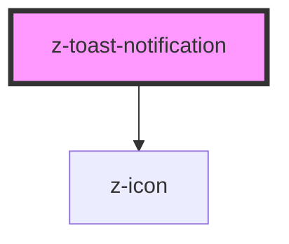

# z-toast-notification

<!-- Auto Generated Below -->

## Properties

| Property              | Attribute             | Description                                                                                  | Type                                                                                                                                                                                                                                                                                                                                                                                                             | Default     |
| --------------------- | --------------------- | -------------------------------------------------------------------------------------------- | ---------------------------------------------------------------------------------------------------------------------------------------------------------------------------------------------------------------------------------------------------------------------------------------------------------------------------------------------------------------------------------------------------------------- | ----------- |
| `autoclose`           | `autoclose`           | toast notification closing timeout (ms)                                                      | `number`                                                                                                                                                                                                                                                                                                                                                                                                         | `undefined` |
| `closebutton`         | `closebutton`         | toggles closing button rendering                                                             | `boolean`                                                                                                                                                                                                                                                                                                                                                                                                        | `undefined` |
| `draggablepercentage` | `draggablepercentage` | toast notification draggable percentage                                                      | `number`                                                                                                                                                                                                                                                                                                                                                                                                         | `80`        |
| `heading`             | `heading`             | toast notification's title                                                                   | `string`                                                                                                                                                                                                                                                                                                                                                                                                         | `undefined` |
| `isdraggable`         | `isdraggable`         | toast notification can be draggable                                                          | `boolean`                                                                                                                                                                                                                                                                                                                                                                                                        | `true`      |
| `message`             | `message`             | toast notification's message                                                                 | `string`                                                                                                                                                                                                                                                                                                                                                                                                         | `undefined` |
| `pauseonfocusloss`    | `pauseonfocusloss`    | toast notification autoclose can be paused                                                   | `boolean`                                                                                                                                                                                                                                                                                                                                                                                                        | `true`      |
| `transition`          | `transition`          | toast notification animation type: slide-in-left, slide-in-right, slide-in-down, slide-in-up | `ToastNotificationTransitionsEnum.SLIDE_IN_DOWN \| ToastNotificationTransitionsEnum.SLIDE_IN_LEFT \| ToastNotificationTransitionsEnum.SLIDE_IN_RIGHT \| ToastNotificationTransitionsEnum.SLIDE_IN_UP \| ToastNotificationTransitionsEnum.SLIDE_OUT_DOWN \| ToastNotificationTransitionsEnum.SLIDE_OUT_LEFT \| ToastNotificationTransitionsEnum.SLIDE_OUT_RIGHT \| ToastNotificationTransitionsEnum.SLIDE_OUT_UP` | `undefined` |
| `type`                | `type`                | toast notification type:  dark, light, accent, error, success, warning                       | `ToastNotificationEnum.ACCENT \| ToastNotificationEnum.DARK \| ToastNotificationEnum.ERROR \| ToastNotificationEnum.LIGHT \| ToastNotificationEnum.SUCCESS \| ToastNotificationEnum.WARNING`                                                                                                                                                                                                                     | `undefined` |

## Events

| Event        | Description              | Type               |
| ------------ | ------------------------ | ------------------ |
| `toastClose` | notification close event | `CustomEvent<any>` |

## Dependencies

### Depends on

- [z-icon](../../icons/z-icon)

### Graph

----------------------------------------------

*Built with [StencilJS](https://stenciljs.com/)*
