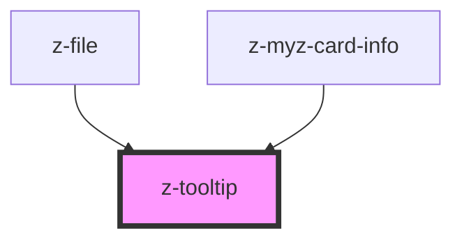

# z-tooltip
Use the `bindTo` property (`bind-to` in HTML) to bind the tooltip to an element, so the tooltip knows where to place itself. Its value can be a CSS selector or an HTMLElement.

You can use the `open` prop to show/hide the tooltip.

Maybe you want to know where the tooltip goes when the `type` is set to `auto`, so the `positionChange` event is fired when it changes its position.

To be sure the algorithm finds the right container, when calculating the position, set its position to `position: relative;`

<!-- readme-group="tootlip" -->
### Usage
```html
<z-tooltip type="top" bind-to="#tooltip-btn" open>
  <span>Tooltip text</span>
</z-tooltip>
<button id="tooltip-btn">Button</button>
```

### Legacy version
```html
<z-tooltip content="Aggiungi libro" type="top"></z-tooltip>
<z-tooltip content="Aggiungi libro" type="bottom"></z-tooltip>
<z-tooltip content="Rimuovi libro" type="left"></z-tooltip>
<z-tooltip content="Rimuovi libro" type="right"></z-tooltip>
```


<!-- Auto Generated Below -->


## Properties

| Property  | Attribute | Description                                                             | Type                                                                                                                                                                                                                                             | Default                |
| --------- | --------- | ----------------------------------------------------------------------- | ------------------------------------------------------------------------------------------------------------------------------------------------------------------------------------------------------------------------------------------------ | ---------------------- |
| `bindTo`  | `bind-to` | The selector or the element bound with the tooltip.                     | `HTMLElement \| string`                                                                                                                                                                                                                          | `undefined`            |
| `content` | `content` | <span style="color:red">**[DEPRECATED]**</span> <br/><br/>Content text. | `string`                                                                                                                                                                                                                                         | `undefined`            |
| `open`    | `open`    | The open state of the tooltip.                                          | `boolean`                                                                                                                                                                                                                                        | `false`                |
| `type`    | `type`    | Tooltip position.                                                       | `TooltipPosition.AUTO \| TooltipPosition.BOTTOM \| TooltipPosition.BOTTOM_LEFT \| TooltipPosition.BOTTOM_RIGHT \| TooltipPosition.LEFT \| TooltipPosition.RIGHT \| TooltipPosition.TOP \| TooltipPosition.TOP_LEFT \| TooltipPosition.TOP_RIGHT` | `TooltipPosition.AUTO` |


## Events

| Event            | Description            | Type               |
| ---------------- | ---------------------- | ------------------ |
| `positionChange` | Position change event. | `CustomEvent<any>` |


## Dependencies

### Used by

 - [z-file](../../file-upload/z-file)
 - [z-myz-card-info](../../../snowflakes/myz/card/z-myz-card-info)

### Graph


----------------------------------------------

*Built with [StencilJS](https://stenciljs.com/)*
