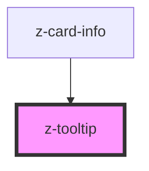

# z-tooltip

<!-- readme-group="tootlip" -->
```html
<z-tooltip content="Aggiungi libro" type="top"></z-tooltip>
<z-tooltip content="Aggiungi libro" type="bottom"></z-tooltip>
<z-tooltip content="Rimuovi libro" type="left"></z-tooltip>
<z-tooltip content="Rimuovi libro" type="right"></z-tooltip>
```


<!-- Auto Generated Below -->


## Properties

| Property  | Attribute | Description              | Type                                                                                                                         | Default     |
| --------- | --------- | ------------------------ | ---------------------------------------------------------------------------------------------------------------------------- | ----------- |
| `content` | `content` | content text             | `string`                                                                                                                     | `undefined` |
| `type`    | `type`    | tooltip position variant | `TooltipPosition.BOTTOM \| TooltipPosition.LEFT \| TooltipPosition.NO_ARROW \| TooltipPosition.RIGHT \| TooltipPosition.TOP` | `undefined` |


## Dependencies

### Used by

 - [z-card-info](../../card/z-card-info)

### Graph


----------------------------------------------

*Built with [StencilJS](https://stenciljs.com/)*
