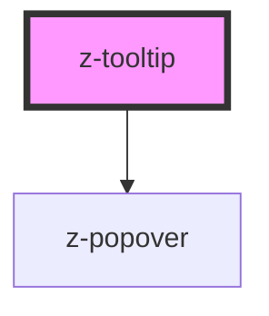

# z-tooltip

Use the `bindTo` property (`bind-to` in HTML) to bind the tooltip to an element, so the tooltip knows where to place itself. Its value can be a CSS selector or an HTMLElement.

You can use the `open` prop to show/hide the tooltip.

Maybe you want to know where the tooltip goes when the `position` is set to `auto`, so the `positionChange` event is fired when it changes its position.

To be sure the algorithm finds the right container, when calculating the position, set its position to `position: relative;`

<!-- readme-group="toltip" -->

### Usage

```html
<z-tooltip
  type="top"
  bind-to="#tooltip-btn"
  open
>
  <span>Tooltip text</span>
</z-tooltip>
<button id="tooltip-btn">Button</button>
```

<!-- Auto Generated Below -->

## Properties

| Property   | Attribute  | Description                                         | Type                                                                                                                                                                                                                                                                                                                                                                                  | Default                 |
| ---------- | ---------- | --------------------------------------------------- | ------------------------------------------------------------------------------------------------------------------------------------------------------------------------------------------------------------------------------------------------------------------------------------------------------------------------------------------------------------------------------------- | ----------------------- |
| `bindTo`   | `bind-to`  | The selector or the element bound with the tooltip. | `HTMLElement \| string`                                                                                                                                                                                                                                                                                                                                                               | `undefined`             |
| `dark`     | `dark`     | Enable tooltip dark mode.                           | `boolean`                                                                                                                                                                                                                                                                                                                                                                             | `false`                 |
| `open`     | `open`     | The open state of the tooltip.                      | `boolean`                                                                                                                                                                                                                                                                                                                                                                             | `false`                 |
| `position` | `position` | Tooltip position.                                   | `PopoverPositions.AUTO \| PopoverPositions.BOTTOM \| PopoverPositions.BOTTOM_LEFT \| PopoverPositions.BOTTOM_RIGHT \| PopoverPositions.LEFT \| PopoverPositions.LEFT_BOTTOM \| PopoverPositions.LEFT_TOP \| PopoverPositions.RIGHT \| PopoverPositions.RIGHT_BOTTOM \| PopoverPositions.RIGHT_TOP \| PopoverPositions.TOP \| PopoverPositions.TOP_LEFT \| PopoverPositions.TOP_RIGHT` | `PopoverPositions.AUTO` |

## Dependencies

### Depends on

- [z-popover](../../z-popover)

### Graph



---

_Built with [StencilJS](https://stenciljs.com/)_
