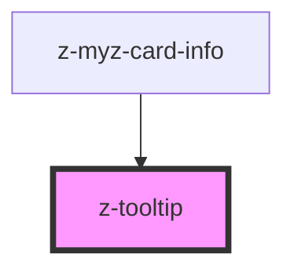

# z-tooltip

<!-- readme-group="tootlip" -->
```html
<z-tooltip content="Aggiungi libro" type="top"></z-tooltip>
<z-tooltip content="Aggiungi libro" type="bottom"></z-tooltip>
<z-tooltip content="Rimuovi libro" type="left"></z-tooltip>
<z-tooltip content="Rimuovi libro" type="right"></z-tooltip>
```


<!-- Auto Generated Below -->


## Properties

| Property  | Attribute | Description      | Type                                                                                                                                                                                                                     | Default     |
| --------- | --------- | ---------------- | ------------------------------------------------------------------------------------------------------------------------------------------------------------------------------------------------------------------------ | ----------- |
| `content` | `content` | Content text     | `string`                                                                                                                                                                                                                 | `undefined` |
| `type`    | `type`    | Tooltip position | `TooltipPosition.BOTTOM \| TooltipPosition.BOTTOM_LEFT \| TooltipPosition.BOTTOM_RIGHT \| TooltipPosition.LEFT \| TooltipPosition.RIGHT \| TooltipPosition.TOP \| TooltipPosition.TOP_LEFT \| TooltipPosition.TOP_RIGHT` | `undefined` |


## Dependencies

### Used by

 - [z-myz-card-info](../../../snowflakes/myz/card/z-myz-card-info)

### Graph


----------------------------------------------

*Built with [StencilJS](https://stenciljs.com/)*
