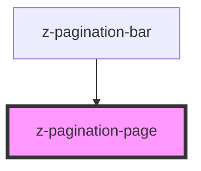

# z-pagination-page

<!-- readme-group="pagination" -->
```html
<z-pagination-page pageId='10' value='10'></z-pagination-page>
<z-pagination-page pageId='10' value='10' isdisabled></z-pagination-page>
<z-pagination-page pageId='10' value='10' isselected isvisited></z-pagination-page>
```


<!-- Auto Generated Below -->


## Properties

| Property     | Attribute    | Description                   | Type      | Default     |
| ------------ | ------------ | ----------------------------- | --------- | ----------- |
| `ariaLabel`  | `aria-label` | aria-label string             | `string`  | `undefined` |
| `isdisabled` | `isdisabled` | disabled status flag          | `boolean` | `false`     |
| `isselected` | `isselected` | selected status flag          | `boolean` | `false`     |
| `isvisited`  | `isvisited`  | visited status flag           | `boolean` | `false`     |
| `pageid`     | `pageid`     | html id                       | `string`  | `undefined` |
| `value`      | `value`      | numeric page value (optional) | `number`  | `undefined` |


## Dependencies

### Used by

 - [z-pagination-bar](../z-pagination-bar)

### Graph


----------------------------------------------

*Built with [StencilJS](https://stenciljs.com/)*
