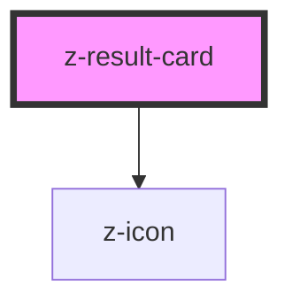

# z-result-card

<!-- Auto Generated Below -->

## Properties

| Property            | Attribute             | Description                                                                                                           | Type      | Default     |
| ------------------- | --------------------- | --------------------------------------------------------------------------------------------------------------------- | --------- | ----------- |
| `authors`           | `authors`             | The authors of the opera.                                                                                             | `string`  | `undefined` |
| `cardSubtitle`      | `card-subtitle`       | The subtitle of the card.                                                                                             | `string`  | `undefined` |
| `cardTitle`         | `card-title`          | The title of the card.                                                                                                | `string`  | `undefined` |
| `cover`             | `cover`               | The URL of the cover image. This is used to display the cover image of the opera.                                     | `string`  | `undefined` |
| `fallbackCover`     | `fallback-cover`      | [optional] Fallback cover URL                                                                                         | `string`  | `undefined` |
| `hasMultipleCovers` | `has-multiple-covers` | Indicates whether the card has multiple covers. This is used to apply specific styles when there are multiple covers. | `boolean` | `false`     |
| `isInfoCard`        | `is-info-card`        | Indicates whether the card is an info page. This can be used to apply specific styles or behaviors for info pages.    | `boolean` | `false`     |

## Dependencies

### Depends on

- [z-icon](../../z-icon)

### Graph

----------------------------------------------

*Built with [StencilJS](https://stenciljs.com/)*
