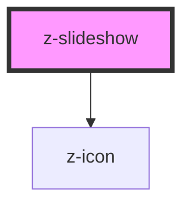

# z-slideshow

<!-- Auto Generated Below -->

## Properties

| Property      | Attribute     | Description                      | Type     | Default     |
| ------------- | ------------- | -------------------------------- | -------- | ----------- |
| `data`        | `data`        | JSON stringified link url images | `string` | `""`        |
| `slideshowid` | `slideshowid` |                                  | `string` | `undefined` |

## Dependencies

### Depends on

- [z-icon](../icons/z-icon)

### Graph

----------------------------------------------

*Built with [StencilJS](https://stenciljs.com/)*
