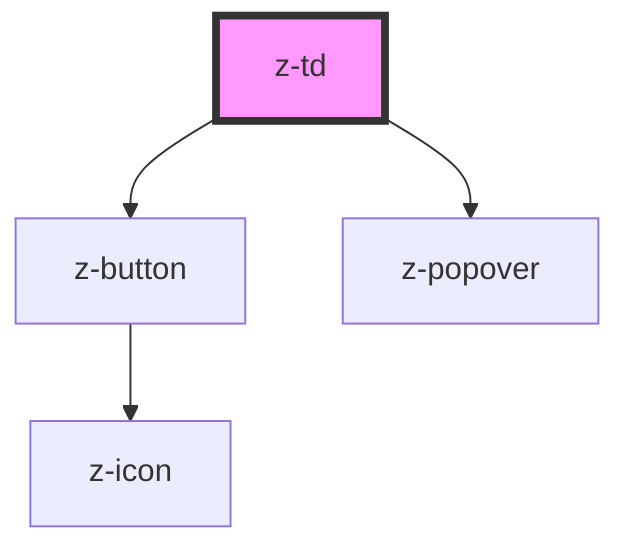

# z-td

<!-- Auto Generated Below -->

## Overview

ZTd component.

## Properties

| Property          | Attribute          | Description                                                                                                                                                  | Type                                                                                                                                                                                                                                                                                                                                                                     | Default                |
| ----------------- | ------------------ | ------------------------------------------------------------------------------------------------------------------------------------------------------------ | ------------------------------------------------------------------------------------------------------------------------------------------------------------------------------------------------------------------------------------------------------------------------------------------------------------------------------------------------------------------------ | ---------------------- |
| `colspan`         | `colspan`          | Number of columns that the cell should span.                                                                                                                 | `number`                                                                                                                                                                                                                                                                                                                                                                 | `undefined`            |
| `popoverPosition` | `popover-position` | Set the popover position, the default is "auto".                                                                                                             | `PopoverPosition.AUTO \| PopoverPosition.BOTTOM \| PopoverPosition.BOTTOM_LEFT \| PopoverPosition.BOTTOM_RIGHT \| PopoverPosition.LEFT \| PopoverPosition.LEFT_BOTTOM \| PopoverPosition.LEFT_TOP \| PopoverPosition.RIGHT \| PopoverPosition.RIGHT_BOTTOM \| PopoverPosition.RIGHT_TOP \| PopoverPosition.TOP \| PopoverPosition.TOP_LEFT \| PopoverPosition.TOP_RIGHT` | `PopoverPosition.AUTO` |
| `showMenu`        | `show-menu`        | Enables the contextual menu. Can be set to "hover" or "always" to show the button only on cell hover or always. Set a nullish value to hide the menu button. | `VisibilityCondition.ALWAYS \| VisibilityCondition.HOVER`                                                                                                                                                                                                                                                                                                                | `null`                 |
| `sticky`          | `sticky`           | Whether the cell should stick.                                                                                                                               | `boolean`                                                                                                                                                                                                                                                                                                                                                                | `false`                |

## Events

| Event           | Description                                      | Type                  |
| --------------- | ------------------------------------------------ | --------------------- |
| `colspanChange` | Emitted when the value of the `colspan` changes. | `CustomEvent<number>` |

## Slots

| Slot | Description  |
| ---- | ------------ |
|      | ZTd content. |

## Dependencies

### Depends on

- [z-button](../../../z-button)
- [z-popover](../../../z-popover)

### Graph

----------------------------------------------

*Built with [StencilJS](https://stenciljs.com/)*
