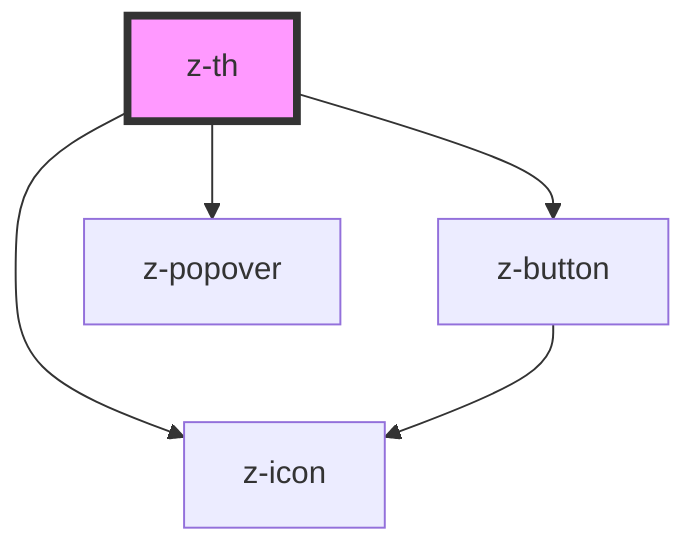

# z-th

<!-- Auto Generated Below -->

## Overview

ZTh component.

## Properties

| Property          | Attribute          | Description                                                                                                                                                  | Type                                                                                                                                                                                                                                                                                                                                                                     | Default                |
| ----------------- | ------------------ | ------------------------------------------------------------------------------------------------------------------------------------------------------------ | ------------------------------------------------------------------------------------------------------------------------------------------------------------------------------------------------------------------------------------------------------------------------------------------------------------------------------------------------------------------------ | ---------------------- |
| `colspan`         | `colspan`          | Number of columns that the cell should span.                                                                                                                 | `number`                                                                                                                                                                                                                                                                                                                                                                 | `undefined`            |
| `popoverPosition` | `popover-position` | Set popover position.                                                                                                                                        | `PopoverPosition.AUTO \| PopoverPosition.BOTTOM \| PopoverPosition.BOTTOM_LEFT \| PopoverPosition.BOTTOM_RIGHT \| PopoverPosition.LEFT \| PopoverPosition.LEFT_BOTTOM \| PopoverPosition.LEFT_TOP \| PopoverPosition.RIGHT \| PopoverPosition.RIGHT_BOTTOM \| PopoverPosition.RIGHT_TOP \| PopoverPosition.TOP \| PopoverPosition.TOP_LEFT \| PopoverPosition.TOP_RIGHT` | `PopoverPosition.AUTO` |
| `showMenu`        | `show-menu`        | Enables the contextual menu. Can be set to "hover" or "always" to show the button only on cell hover or always. Set a nullish value to hide the menu button. | `VisibilityCondition.ALWAYS \| VisibilityCondition.HOVER`                                                                                                                                                                                                                                                                                                                | `null`                 |
| `showSorting`     | `show-sorting`     | Enables the sorting button. Can be set to "hover" or "always" to show the button only on cell hover or always. Set a nullish value to hide the sort button.  | `VisibilityCondition.ALWAYS \| VisibilityCondition.HOVER`                                                                                                                                                                                                                                                                                                                | `null`                 |
| `sortDirection`   | `sort-direction`   | Current sorting direction. Set `SortDirection.ASC` or `SortDirection.DESC` to show the sort icon.                                                            | `SortDirection.ASC \| SortDirection.DESC`                                                                                                                                                                                                                                                                                                                                | `undefined`            |
| `sticky`          | `sticky`           | Whether the cell should stick.                                                                                                                               | `boolean`                                                                                                                                                                                                                                                                                                                                                                | `false`                |

## Events

| Event  | Description                                                                                                                                                                                       | Type               |
| ------ | ------------------------------------------------------------------------------------------------------------------------------------------------------------------------------------------------- | ------------------ |
| `sort` | Sort event fired when the user clicks on the sort button. The sorting logic must be implemented by the app. You can set an `id` on the `z-th` to easly identify the column in the event listener. | `CustomEvent<any>` |

## Slots

| Slot                | Description                                                    |
| ------------------- | -------------------------------------------------------------- |
|                     | ZTh content.                                                   |
| `"contextual-menu"` | Contextual menu content. Only visible when `showMenu` is true. |

## Dependencies

### Depends on

- [z-icon](../../../z-icon)
- [z-button](../../../z-button)
- [z-popover](../../../z-popover)

### Graph

----------------------------------------------

*Built with [StencilJS](https://stenciljs.com/)*
