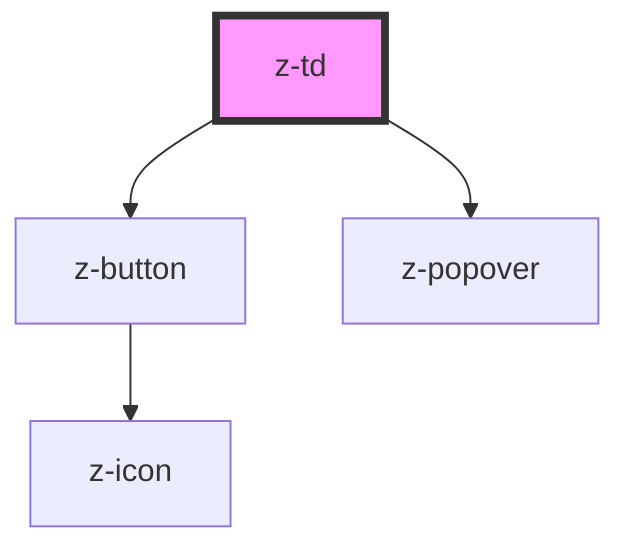

# z-td

<!-- Auto Generated Below -->

## Properties

| Property   | Attribute   | Description                                                                            | Type      | Default     |
| ---------- | ----------- | -------------------------------------------------------------------------------------- | --------- | ----------- |
| `colspan`  | `colspan`   | Number of columns that the cell should span.                                           | `number`  | `undefined` |
| `showMenu` | `show-menu` | Enables the contextual menu. If true, a contextual menu button will be shown on hover. | `boolean` | `false`     |
| `sticky`   | `sticky`    | Whether the cell should stick.                                                         | `boolean` | `false`     |

## Events

| Event           | Description                                      | Type                  |
| --------------- | ------------------------------------------------ | --------------------- |
| `colspanChange` | Emitted when the value of the `colspan` changes. | `CustomEvent<number>` |

## Slots

| Slot | Description  |
| ---- | ------------ |
|      | ZTd content. |

## Dependencies

### Depends on

- [z-button](../../buttons/z-button)
- [z-popover](../../z-popover)

### Graph

----------------------------------------------

*Built with [StencilJS](https://stenciljs.com/)*
