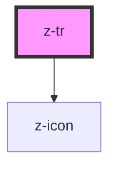

# z-tr

<!-- Auto Generated Below -->

## Overview

ZTr component.
When the row is `expandable`, you can set the `prevent-expand` css class on an interactive element inside the row
to prevent the row from expanding.

## Properties

| Property     | Attribute    | Description                                                                                                                                                                                                                                                                                                                                                  | Type      | Default |
| ------------ | ------------ | ------------------------------------------------------------------------------------------------------------------------------------------------------------------------------------------------------------------------------------------------------------------------------------------------------------------------------------------------------------ | --------- | ------- |
| `expandable` | `expandable` | Whether the row is expandable. Use a `z-td` as the last cell of the row for the additional content. It will show a button to expand/collapse the row. The last cell will be hidden until the button or row is clicked.  If some element inside the expandable row contains the `prevent-expand` css class, the row will not expand by clicking that element. | `boolean` | `false` |

## Events

| Event    | Description           | Type               |
| -------- | --------------------- | ------------------ |
| `expand` | Row has been expanded | `CustomEvent<any>` |

## Slots

| Slot | Description                     |
| ---- | ------------------------------- |
|      | ZTr content (`z-td` or `z-th`). |

## Dependencies

### Depends on

- [z-icon](../../z-icon)

### Graph

----------------------------------------------

*Built with [StencilJS](https://stenciljs.com/)*
