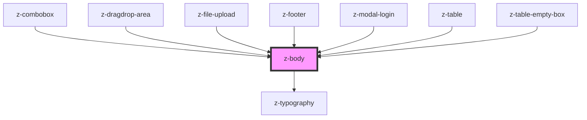

# z-body

<!-- Auto Generated Below -->

## Properties

| Property    | Attribute   | Description                             | Type                      | Default     |
| ----------- | ----------- | --------------------------------------- | ------------------------- | ----------- |
| `component` | `component` | HTML tag to use to wrap slotted content | `string`                  | `undefined` |
| `level`     | `level`     | Typography level                        | `1 \| 2 \| 3 \| 4 \| 5`   | `undefined` |
| `variant`   | `variant`   | Font weight variant                     | `"regular" \| "semibold"` | `"regular"` |

## Dependencies

### Used by

- [z-combobox](../../inputs/z-combobox)
- [z-dragdrop-area](../../file-upload/z-dragdrop-area)
- [z-file-upload](../../file-upload/z-file-upload)
- [z-footer](../../footer/z-footer)
- [z-modal-login](../../modal/z-modal-login)
- [z-table](../../z-table/z-table)
- [z-table-empty-box](../../z-table/z-table-empty-box)

### Depends on

- [z-typography](../z-typography)

### Graph

---

_Built with [StencilJS](https://stenciljs.com/)_
