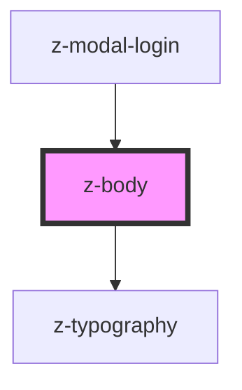

# z-body

<!-- Auto Generated Below -->

## Properties

| Property    | Attribute   | Description | Type                      | Default     |
| ----------- | ----------- | ----------- | ------------------------- | ----------- |
| `component` | `component` |             | `string`                  | `undefined` |
| `level`     | `level`     |             | `1 \| 2 \| 3 \| 4 \| 5`   | `undefined` |
| `variant`   | `variant`   |             | `"regular" \| "semibold"` | `"regular"` |

## Dependencies

### Used by

 - [z-modal-login](../../modal/z-modal-login)

### Depends on

- [z-typography](../z-typography)

### Graph

----------------------------------------------

*Built with [StencilJS](https://stenciljs.com/)*
