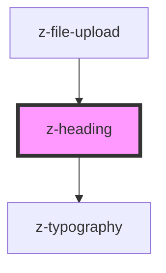

# z-heading

<!-- Auto Generated Below -->

## Properties

| Property    | Attribute   | Description | Type                                 | Default     |
| ----------- | ----------- | ----------- | ------------------------------------ | ----------- |
| `component` | `component` |             | `string`                             | `undefined` |
| `level`     | `level`     |             | `1 \| 2 \| 3 \| 4`                   | `undefined` |
| `variant`   | `variant`   |             | `"light" \| "regular" \| "semibold"` | `"regular"` |

## Dependencies

### Used by

 - [z-file-upload](../../file-upload/z-file-upload)

### Depends on

- [z-typography](../z-typography)

### Graph

----------------------------------------------

*Built with [StencilJS](https://stenciljs.com/)*
