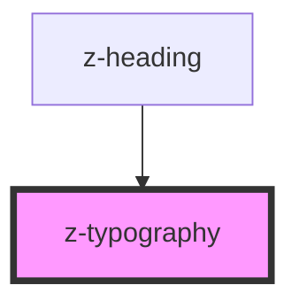

# z-typography

<!-- Auto Generated Below -->

## Properties

| Property    | Attribute   | Description | Type                                 | Default     |
| ----------- | ----------- | ----------- | ------------------------------------ | ----------- |
| `component` | `component` |             | `string`                             | `undefined` |
| `margin`    | `margin`    |             | `boolean`                            | `undefined` |
| `variant`   | `variant`   |             | `"light" \| "regular" \| "semibold"` | `"regular"` |

## Dependencies

### Used by

 - [z-heading](../z-heading)

### Graph

----------------------------------------------

*Built with [StencilJS](https://stenciljs.com/)*
