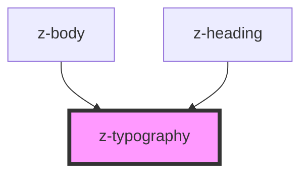

# z-typography

<!-- Auto Generated Below -->

## Properties

| Property    | Attribute   | Description                             | Type                                                                   | Default     |
| ----------- | ----------- | --------------------------------------- | ---------------------------------------------------------------------- | ----------- |
| `component` | `component` | HTML tag to use to wrap slotted content | `string`                                                               | `undefined` |
| `level`     | `level`     | Typography level                        | `"b1" \| "b2" \| "b3" \| "b4" \| "b5" \| "h1" \| "h2" \| "h3" \| "h4"` | `undefined` |
| `variant`   | `variant`   | Font weight variant                     | `"light" \| "regular" \| "semibold"`                                   | `"regular"` |

## Dependencies

### Used by

- [z-body](../z-body)
- [z-heading](../z-heading)

### Graph

---

_Built with [StencilJS](https://stenciljs.com/)_
