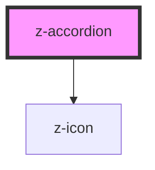

# z-accordion

<!-- Auto Generated Below -->

## Overview

Accordion component.

## Properties

| Property     | Attribute     | Description                                                                      | Type                                                          | Default                    |
| ------------ | ------------- | -------------------------------------------------------------------------------- | ------------------------------------------------------------- | -------------------------- |
| `highlight`  | `highlight`   | Enable highlight band on the `summary`'s left edge.                              | `boolean`                                                     | `false`                    |
| `icon`       | `icon`        | Name of the z-icon to display before the label's text.                           | `string`                                                      | `undefined`                |
| `isDisabled` | `is-disabled` | Disabled state of the accordion.                                                 | `boolean`                                                     | `false`                    |
| `label`      | `label`       | Text label.                                                                      | `string`                                                      | `undefined`                |
| `open`       | `open`        | The open state of the accordion.                                                 | `boolean`                                                     | `false`                    |
| `shadow`     | `shadow`      | Enable box-shadow on the accordion. Only applies when `variant` is `BACKGROUND`. | `boolean`                                                     | `true`                     |
| `size`       | `size`        | Size of the component.                                                           | `ControlSize.BIG \| ControlSize.SMALL \| ControlSize.X_SMALL` | `ControlSize.BIG`          |
| `variant`    | `variant`     | Accordion variant.                                                               | `AccordionVariant.BACKGROUND \| AccordionVariant.DEFAULT`     | `AccordionVariant.DEFAULT` |

## Events

| Event     | Description                                | Type                   |
| --------- | ------------------------------------------ | ---------------------- |
| `toggled` | Event fired when the accordion is toggled. | `CustomEvent<boolean>` |

## Slots

| Slot    | Description                |
| ------- | -------------------------- |
|         | Slot for the main content. |
| `"tag"` | Slot for tags.             |

## Shadow Parts

| Part        | Description |
| ----------- | ----------- |
| `"content"` |             |
| `"summary"` |             |

## Dependencies

### Depends on

- [z-icon](../z-icon)

### Graph

----------------------------------------------

*Built with [StencilJS](https://stenciljs.com/)*
