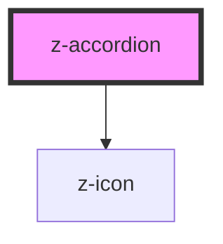

# z-accordion

<!-- Auto Generated Below -->

## Properties

| Property       | Attribute       | Description                                                                                                      | Type                                                          | Default           |
| -------------- | --------------- | ---------------------------------------------------------------------------------------------------------------- | ------------------------------------------------------------- | ----------------- |
| `icon`         | `icon`          | Name of the z-icon to display before the label's text.                                                           | `string`                                                      | `undefined`       |
| `label`        | `label`         | Text label.                                                                                                      | `string`                                                      | `undefined`       |
| `size`         | `size`          | Size of the component.                                                                                           | `ControlSize.BIG \| ControlSize.SMALL \| ControlSize.X_SMALL` | `ControlSize.BIG` |
| `stackContext` | `stack-context` | Whether the component is placed in a stack of ZAccordion components. When enabled, the bottom border is removed. | `boolean`                                                     | `false`           |

## Slots

| Slot    | Description                |
| ------- | -------------------------- |
|         | Slot for the main content. |
| `"tag"` | Slot for tags.             |

## Dependencies

### Depends on

- [z-icon](../icons/z-icon)

### Graph

----------------------------------------------

*Built with [StencilJS](https://stenciljs.com/)*
