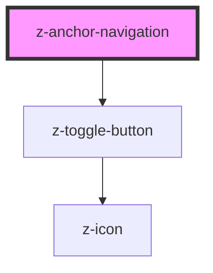

# z-anchor-navigation

<!-- Auto Generated Below -->

## Properties

| Property         | Attribute         | Description                                                                                                    | Type      | Default |
| ---------------- | ----------------- | -------------------------------------------------------------------------------------------------------------- | --------- | ------- |
| `hideUnselected` | `hide-unselected` | If enabled, the text of each anchor will be hidden unless for the current one or the one the user is hovering. | `boolean` | `false` |

## Slots

| Slot                                                                                                                  | Description |
| --------------------------------------------------------------------------------------------------------------------- | ----------- |
| `"Main slot. Put some `<a>` tags inside. If you need an action button/icon, wrap it and the <a> inside another tag."` |             |

## Dependencies

### Depends on

- [z-toggle-button](../buttons/z-toggle-button)

### Graph

----------------------------------------------

*Built with [StencilJS](https://stenciljs.com/)*
