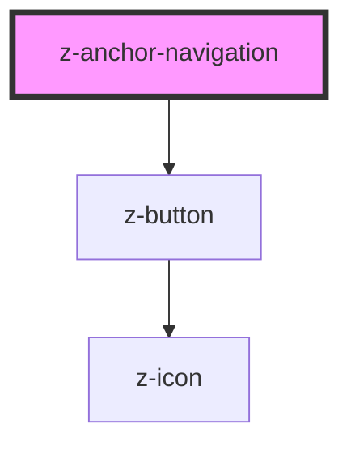

# z-anchor-navigation

<!-- Auto Generated Below -->

## Overview

Anchor navigation component.

## Properties

| Property         | Attribute         | Description                                                                                                                                                                                                                                                                                                            | Type      | Default     |
| ---------------- | ----------------- | ---------------------------------------------------------------------------------------------------------------------------------------------------------------------------------------------------------------------------------------------------------------------------------------------------------------------- | --------- | ----------- |
| `autoCurrent`    | `auto-current`    | Enables automatic inference of the current item, listening for hash change and checking the `href` of the slotted anchors. When disabled, the highlight of current item must be handled manually by setting the `data-current` attribute to the correct slotted items and the `aria-current` attribute to the anchors. | `boolean` | `true`      |
| `collapsedLabel` | `collapsed-label` | Sets the label of the button displayed on mobile viewport when the anchor navigation is collapsed                                                                                                                                                                                                                      | `string`  | `"salta a"` |
| `hideUnselected` | `hide-unselected` | If enabled, the text of each anchor will be hidden unless for the current one or the one the user is hovering.                                                                                                                                                                                                         | `boolean` | `false`     |
| `isCollapsed`    | `is-collapsed`    | Explicitly collapse anchor navigation. If false will collapse automatically only on mobile.                                                                                                                                                                                                                            | `boolean` | `false`     |

## Slots

| Slot | Description                                                                                                                      |
| ---- | -------------------------------------------------------------------------------------------------------------------------------- |
|      | Anchor navigation items. Use `<a>` elements inside. If you need an extra action element, use a wrapper around it and the anchor. |

## Dependencies

### Depends on

- [z-button](../z-button)

### Graph

----------------------------------------------

*Built with [StencilJS](https://stenciljs.com/)*
