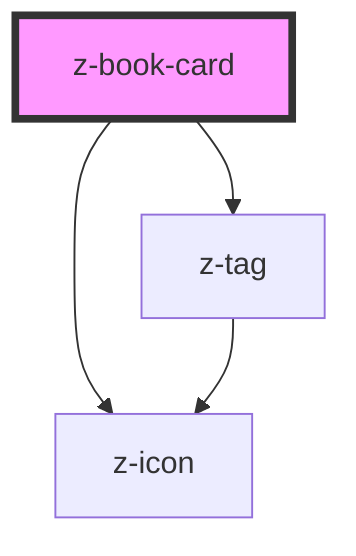

# z-book-card

<!-- Auto Generated Below -->

## Properties

| Property            | Attribute            | Description                                                      | Type                                                                                                                                     | Default                    |
| ------------------- | -------------------- | ---------------------------------------------------------------- | ---------------------------------------------------------------------------------------------------------------------------------------- | -------------------------- |
| `authors`           | `authors`            | [optional] Authors                                               | `string`                                                                                                                                 | `undefined`                |
| `cover`             | `cover`              | Cover URL                                                        | `string`                                                                                                                                 | `undefined`                |
| `fallbackCover`     | `fallback-cover`     | [optional] Fallback cover URL                                    | `string`                                                                                                                                 | `undefined`                |
| `isbn`              | `isbn`               | [optional] Main ISBN                                             | `string`                                                                                                                                 | `undefined`                |
| `isbnLabel`         | `isbn-label`         | [optional] ISBN label                                            | `string`                                                                                                                                 | `""`                       |
| `operaTitle`        | `opera-title`        | Card main title                                                  | `string`                                                                                                                                 | `undefined`                |
| `operaTitleTag`     | `opera-title-tag`    | [optional] [accessibility] Card title HTML tag                   | `string`                                                                                                                                 | `undefined`                |
| `ribbonIcon`        | `ribbon-icon`        | [optional] Ribbon icon - expanded and search variant only        | `string`                                                                                                                                 | `undefined`                |
| `ribbonInteractive` | `ribbon-interactive` | [optional] Ribbon interactive - expanded and search variant only | `boolean`                                                                                                                                | `undefined`                |
| `tags`              | `tags`               | [optional] Ribbon label - expanded and search variant only       | `CardTag[] \| string`                                                                                                                    | `undefined`                |
| `variant`           | `variant`            | Card variant: landscape, portrait                                | `BookCardVariant.COMPACT \| BookCardVariant.EXPANDED \| BookCardVariant.LANDSCAPE \| BookCardVariant.PORTRAIT \| BookCardVariant.SEARCH` | `BookCardVariant.PORTRAIT` |
| `volumeTitle`       | `volume-title`       | [optional] Card subtitle                                         | `string`                                                                                                                                 | `undefined`                |

## Events

| Event         | Description                 | Type               |
| ------------- | --------------------------- | ------------------ |
| `ribbonClick` | click on interactive ribbon | `CustomEvent<any>` |

## Slots

| Slot           | Description                                                        |
| -------------- | ------------------------------------------------------------------ |
| `"footer-cta"` | footer cta button (search and compact variant only)                |
| `"header-cta"` | header CTA (e.g. bookmark icon - extended and search variant only) |
| `"resources"`  | books resources (extended variant only)                            |
| `"tags"`       | card tags (extended and search variant only)                       |

## Dependencies

### Depends on

- [z-tag](../z-tag)
- [z-icon](../z-icon)

### Graph

----------------------------------------------

*Built with [StencilJS](https://stenciljs.com/)*
