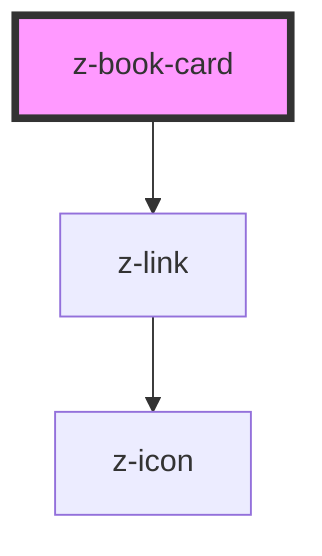

# z-book-card

<!-- Auto Generated Below -->

## Properties

| Property        | Attribute         | Description                                    | Type                                                                            | Default     |
| --------------- | ----------------- | ---------------------------------------------- | ------------------------------------------------------------------------------- | ----------- |
| `authors`       | `authors`         | [optional] Authors                             | `string`                                                                        | `undefined` |
| `cover`         | `cover`           | Cover URL                                      | `string`                                                                        | `undefined` |
| `fallbackCover` | `fallback-cover`  | [optional] Fallback cover URL                  | `string`                                                                        | `undefined` |
| `isbn`          | `isbn`            | [optional] Main ISBN                           | `string`                                                                        | `undefined` |
| `operaTitle`    | `opera-title`     | Card main title                                | `string`                                                                        | `undefined` |
| `operaTitleTag` | `opera-title-tag` | [optional] [accessibility] Card title HTML tag | `string`                                                                        | `undefined` |
| `ribbon`        | `ribbon`          | [optional] Ribbon label                        | `string`                                                                        | `undefined` |
| `variant`       | `variant`         | Card variant: expanded, compact, search        | `BookCardVariant.COMPACT \| BookCardVariant.EXPANDED \| BookCardVariant.SEARCH` | `undefined` |
| `volumeTitle`   | `volume-title`    | [optional] Card subtitle                       | `string`                                                                        | `undefined` |

## Slots

| Slot           | Description                             |
| -------------- | --------------------------------------- |
| `"footer-cta"` | footer cta button (search variant only) |
| `"header-cta"` | header CTA (e.g. bookmark icon)         |
| `"resources"`  | books resources (extended variant only) |
| `"tags"`       | card tags                               |

## Dependencies

### Depends on

- [z-link](../navigation/z-link)

### Graph

----------------------------------------------

*Built with [StencilJS](https://stenciljs.com/)*
