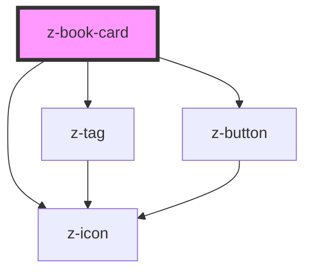

# z-book-card

<!-- Auto Generated Below -->

## Properties

| Property        | Attribute        | Description                                                      | Type                                                                                                                                     | Default                    |
| --------------- | ---------------- | ---------------------------------------------------------------- | ---------------------------------------------------------------------------------------------------------------------------------------- | -------------------------- |
| `adoption`      | `adoption`       | [optional] Ribbon icon - expanded and search variant only        | `boolean`                                                                                                                                | `false`                    |
| `authors`       | `authors`        | [optional] Authors                                               | `string`                                                                                                                                 | `undefined`                |
| `catalogUrl`    | `catalog-url`    | [optional] Ribbon interactive - expanded and search variant only | `string`                                                                                                                                 | `undefined`                |
| `cover`         | `cover`          | Cover URL                                                        | `string`                                                                                                                                 | `undefined`                |
| `ebookUrl`      | `ebook-url`      | [optional] [accessibility] Card title HTML tag                   | `string`                                                                                                                                 | `undefined`                |
| `fallbackCover` | `fallback-cover` | [optional] Fallback cover URL                                    | `string`                                                                                                                                 | `undefined`                |
| `isbn`          | `isbn`           | [optional] Main ISBN                                             | `string`                                                                                                                                 | `undefined`                |
| `operaTitle`    | `opera-title`    | [optional] Card main title                                       | `string`                                                                                                                                 | `undefined`                |
| `tags`          | `tags`           | [optional] Ribbon label - expanded and search variant only       | `CardTag[] \| string`                                                                                                                    | `undefined`                |
| `variant`       | `variant`        | Card variant: landscape, portrait                                | `BookCardVariant.COMPACT \| BookCardVariant.EXPANDED \| BookCardVariant.LANDSCAPE \| BookCardVariant.PORTRAIT \| BookCardVariant.SEARCH` | `BookCardVariant.PORTRAIT` |
| `volumeTitle`   | `volume-title`   | [optional] Card subtitle                                         | `string`                                                                                                                                 | `undefined`                |

## Events

| Event      | Description  | Type               |
| ---------- | ------------ | ------------------ |
| `tagClick` | click on tag | `CustomEvent<any>` |

## Slots

| Slot           | Description                                            |
| -------------- | ------------------------------------------------------ |
| `"cta"`        | to the right of authors and title (e.g. bookmark icon) |
| `"footer-cta"` | footer cta button (search and compact variant only)    |
| `"resources"`  | books resources (extended variant only)                |
| `"tags"`       | card tags (extended and search variant only)           |

## Dependencies

### Depends on

- [z-tag](../z-tag)
- [z-icon](../z-icon)
- [z-button](../z-button)

### Graph

----------------------------------------------

*Built with [StencilJS](https://stenciljs.com/)*
