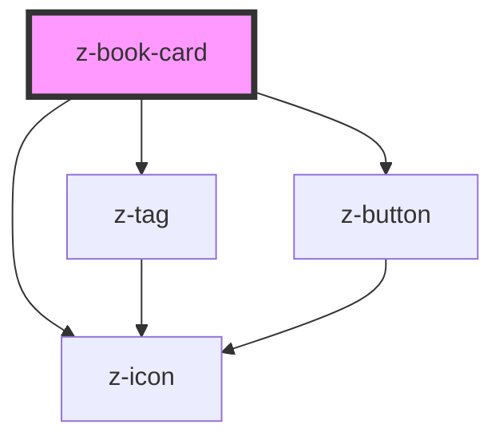

# z-book-card

<!-- Auto Generated Below -->

## Properties

| Property        | Attribute        | Description                                            | Type                                                                                                                                     | Default                    |
| --------------- | ---------------- | ------------------------------------------------------ | ---------------------------------------------------------------------------------------------------------------------------------------- | -------------------------- |
| `adoption`      | `adoption`       | [optional] Show adoption badge                         | `boolean`                                                                                                                                | `false`                    |
| `authors`       | `authors`        | [optional] Authors                                     | `string`                                                                                                                                 | `undefined`                |
| `catalogUrl`    | `catalog-url`    | [optional] Show catalog link to correspondent resource | `string`                                                                                                                                 | `undefined`                |
| `cover`         | `cover`          | Cover URL                                              | `string`                                                                                                                                 | `undefined`                |
| `ebookUrl`      | `ebook-url`      | [optional] Show link to the ebook resource             | `string`                                                                                                                                 | `undefined`                |
| `fallbackCover` | `fallback-cover` | [optional] Fallback cover URL                          | `string`                                                                                                                                 | `undefined`                |
| `isbn`          | `isbn`           | [optional] Main ISBN                                   | `string`                                                                                                                                 | `undefined`                |
| `operaTitle`    | `opera-title`    | [optional] Opera title                                 | `string`                                                                                                                                 | `undefined`                |
| `tags`          | `tags`           | [optional] Tags                                        | `CardTag[] \| string`                                                                                                                    | `undefined`                |
| `variant`       | `variant`        | Card variant: landscape, portrait                      | `BookCardVariant.COMPACT \| BookCardVariant.EXPANDED \| BookCardVariant.LANDSCAPE \| BookCardVariant.PORTRAIT \| BookCardVariant.SEARCH` | `BookCardVariant.PORTRAIT` |
| `volumeTitle`   | `volume-title`   | [optional] Volume title                                | `string`                                                                                                                                 | `undefined`                |

## Events

| Event          | Description           | Type               |
| -------------- | --------------------- | ------------------ |
| `catalogClick` | click on catalog link | `CustomEvent<any>` |
| `ebookClick`   | click on ebook link   | `CustomEvent<any>` |
| `tagClick`     | click on tag          | `CustomEvent<any>` |

## Slots

| Slot     | Description                                            |
| -------- | ------------------------------------------------------ |
| `"apps"` | list of card-related apps                              |
| `"cta"`  | to the right of authors and title (e.g. bookmark icon) |

## Dependencies

### Depends on

- [z-tag](../z-tag)
- [z-icon](../z-icon)
- [z-button](../z-button)

### Graph

----------------------------------------------

*Built with [StencilJS](https://stenciljs.com/)*
