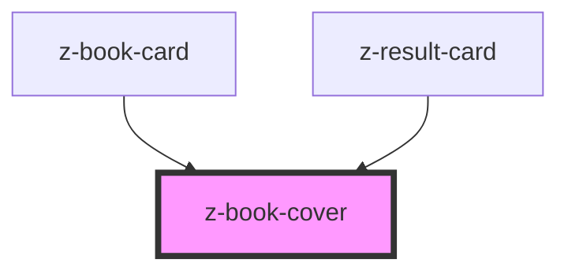

# z-book-cover

<!-- Auto Generated Below -->

## Overview

This component displays a book cover image,
with options for borders and a representation of multiple books with a stack of fake covers behind the original one.
The aspect ratio of the cover image is preserved.
Alignment of the image inside the container can be customized via CSS properties.

## Properties

| Property        | Attribute        | Description                                                                                   | Type      | Default     |
| --------------- | ---------------- | --------------------------------------------------------------------------------------------- | --------- | ----------- |
| `bordered`      | `bordered`       | Whether to apply a border around the cover image (always applied when `multiple` is enabled). | `boolean` | `false`     |
| `cover`         | `cover`          | URL of the cover image.                                                                       | `string`  | `undefined` |
| `fallbackCover` | `fallback-cover` | URL of the fallback cover image.                                                              | `string`  | `undefined` |
| `multiple`      | `multiple`       | Whether to show a stack of covers to represent multiple books.                                | `boolean` | `false`     |

## Slots

| Slot             | Description                                                                                                                                                                                                  |
| ---------------- | ------------------------------------------------------------------------------------------------------------------------------------------------------------------------------------------------------------ |
| `"coverOverlay"` | Content to be displayed over the cover image (e.g. a label). The overlay is positioned at the bottom of the cover. Has some default styling (such as the colored background) that can be customized via CSS. |

## Dependencies

### Used by

 - [z-book-card](../book-card/z-book-card)
 - [z-result-card](../z-result-card)

### Graph

----------------------------------------------

*Built with [StencilJS](https://stenciljs.com/)*
