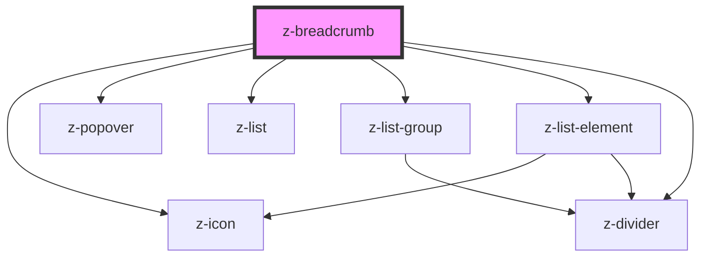

# z-breadcrumb

<!-- Auto Generated Below -->

## Properties

| Property               | Attribute                 | Description                                                                               | Type                                                               | Default                          |
| ---------------------- | ------------------------- | ----------------------------------------------------------------------------------------- | ------------------------------------------------------------------ | -------------------------------- |
| `homepageVariant`      | `homepage-variant`        | [optional] Variant of first node                                                          | `BreadcrumbHomepageVariant.ICON \| BreadcrumbHomepageVariant.TEXT` | `BreadcrumbHomepageVariant.ICON` |
| `maxNodesToShow`       | `max-nodes-to-show`       | [optional] Sets max number of element to show                                             | `number`                                                           | `5`                              |
| `overflowMenuItemRows` | `overflow-menu-item-rows` | [optional] Sets max number of row for each path inside the popover. Zero equals unlimited | `number`                                                           | `0`                              |
| `pathStyle`            | `path-style`              | [optional] Sets the path style                                                            | `BreadcrumbPathStyle.SEMIBOLD \| BreadcrumbPathStyle.UNDERLINED`   | `BreadcrumbPathStyle.UNDERLINED` |
| `preventFollowUrl`     | `prevent-follow-url`      | [optional] Controls the behaviour on <a> tag click/enter                                  | `boolean`                                                          | `false`                          |
| `truncateChar`         | `truncate-char`           | [optional] Sets the maximun number of chars per single node                               | `number`                                                           | `30`                             |

## Events

| Event         | Description                                                         | Type                  |
| ------------- | ------------------------------------------------------------------- | --------------------- |
| `clickOnNode` | Emitted when preventFollowUrl=true to handle custom page transition | `CustomEvent<string>` |

## Dependencies

### Depends on

- [z-icon](../z-icon)
- [z-popover](../z-popover)
- [z-list](../list/z-list)
- [z-list-group](../list/z-list-group)
- [z-list-element](../list/z-list-element)
- [z-divider](../z-divider)

### Graph

----------------------------------------------

*Built with [StencilJS](https://stenciljs.com/)*
