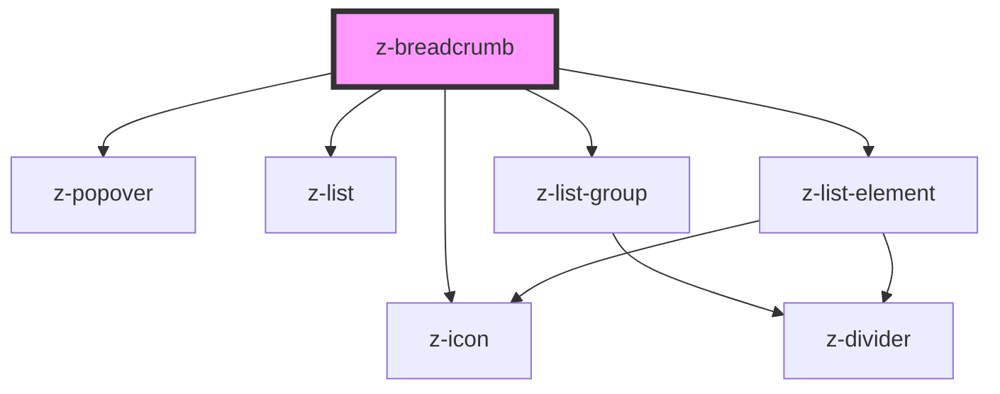

# z-breadcrumb

<!-- Auto Generated Below -->

## Properties

| Property               | Attribute                 | Description                                   | Type                                                               | Default                          |
| ---------------------- | ------------------------- | --------------------------------------------- | ------------------------------------------------------------------ | -------------------------------- |
| `homepageVariant`      | `homepage-variant`        | Variant of first node                         | `BreadcrumbHomepageVariant.ICON \| BreadcrumbHomepageVariant.TEXT` | `BreadcrumbHomepageVariant.ICON` |
| `maxNodesToShow`       | `max-nodes-to-show`       | [optional] Sets max number of element to show | `number`                                                           | `5`                              |
| `overflowMenuItemRows` | `overflow-menu-item-rows` |                                               | `number`                                                           | `0`                              |
| `pathStyle`            | `path-style`              | [optional] Sets the path style                | `BreadcrumbPathStyle.SEMIBOLD \| BreadcrumbPathStyle.UNDERLINED`   | `BreadcrumbPathStyle.UNDERLINED` |
| `paths`                | `paths`                   | Path elements                                 | `BreadcrumbPath[] \| string`                                       | `undefined`                      |
| `preventFollowUrl`     | `prevent-follow-url`      | Controls the behaviour on <a> tag click/enter | `boolean`                                                          | `false`                          |

## Events

| Event         | Description                                                  | Type               |
| ------------- | ------------------------------------------------------------ | ------------------ |
| `clickOnNode` | Emitted when preventFollowUrl=true to handle page transition | `CustomEvent<any>` |

## Dependencies

### Depends on

- [z-icon](../icons/z-icon)
- [z-popover](../z-popover)
- [z-list](../list/z-list)
- [z-list-group](../list/z-list-group)
- [z-list-element](../list/z-list-element)

### Graph

----------------------------------------------

*Built with [StencilJS](https://stenciljs.com/)*
