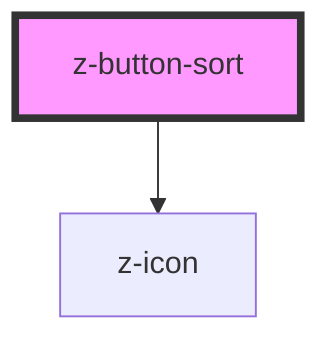

# z-button-sort

<!-- Auto Generated Below -->

## Properties

| Property        | Attribute       | Description                                | Type      | Default     |
| --------------- | --------------- | ------------------------------------------ | --------- | ----------- |
| `buttonid`      | `buttonid`      | id, should be unique                       | `string`  | `undefined` |
| `counter`       | `counter`       | occurrences counter (optional)             | `number`  | `undefined` |
| `desclabel`     | `desclabel`     | label content (descending)                 | `string`  | `undefined` |
| `isselected`    | `isselected`    | selected flag (optional)                   | `boolean` | `false`     |
| `label`         | `label`         | label content (ascending)                  | `string`  | `undefined` |
| `sortasc`       | `sortasc`       | sortable flag (optional)                   | `boolean` | `true`      |
| `sortlabelasc`  | `sortlabelasc`  | sort label content (ascending) (optional)  | `string`  | `"A-Z"`     |
| `sortlabeldesc` | `sortlabeldesc` | sort label content (descending) (optional) | `string`  | `"Z-A"`     |

## Events

| Event             | Description                                                     | Type               |
| ----------------- | --------------------------------------------------------------- | ------------------ |
| `buttonSortClick` | sorting direction click event, returns `buttonid` and `sortAsc` | `CustomEvent<any>` |

## Dependencies

### Depends on

- [z-icon](../z-icon)

### Graph

----------------------------------------------

*Built with [StencilJS](https://stenciljs.com/)*
