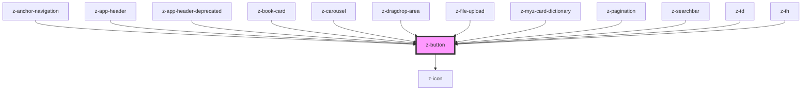

# z-button

<!-- Auto Generated Below -->

## Properties

| Property       | Attribute       | Description                                                                                                                                                                     | Type                                                                                                                      | Default                 |
| -------------- | --------------- | ------------------------------------------------------------------------------------------------------------------------------------------------------------------------------- | ------------------------------------------------------------------------------------------------------------------------- | ----------------------- |
| `ariaLabel`    | `aria-label`    | defines a string value that labels the internal interactive element. Used for accessibility.                                                                                    | `string`                                                                                                                  | `undefined`             |
| `disabled`     | `disabled`      | HTML button disabled attribute.                                                                                                                                                 | `boolean`                                                                                                                 | `false`                 |
| `href`         | `href`          | HTML <a> href attribute. If it is set, it renders an HTML <a> tag.                                                                                                              | `string`                                                                                                                  | `undefined`             |
| `htmlid`       | `htmlid`        | Identifier, should be unique.                                                                                                                                                   | `string`                                                                                                                  | `undefined`             |
| `htmlrole`     | `htmlrole`      | defines role attribute, used for accessibility.                                                                                                                                 | `string`                                                                                                                  | `undefined`             |
| `icon`         | `icon`          | `z-icon` name to use (optional).                                                                                                                                                | `string`                                                                                                                  | `undefined`             |
| `iconPosition` | `icon-position` | the input icon position. Defaults to `left`                                                                                                                                     | `IconPosition.LEFT \| IconPosition.RIGHT`                                                                                 | `IconPosition.LEFT`     |
| `name`         | `name`          | HTML button name attribute.                                                                                                                                                     | `string`                                                                                                                  | `undefined`             |
| `role`         | `role`          | **[DEPRECATED]** This prop has been deprecated in favor of `htmlrole` for better accessibility.  **Deprecated:** Use `htmlrole` instead. | `string`                                                                                                                  | `""`                    |
| `size`         | `size`          | Available sizes: `big`, `small` and `x-small`. Defaults to `big`.                                                                                                               | `ButtonSize.BIG \| ButtonSize.SMALL \| ButtonSize.X_SMALL \| ControlSize.BIG \| ControlSize.SMALL \| ControlSize.X_SMALL` | `ControlSize.BIG`       |
| `target`       | `target`        | HTML a target attribute.                                                                                                                                                        | `string`                                                                                                                  | `undefined`             |
| `type`         | `type`          | HTML button type attribute.                                                                                                                                                     | `ButtonType.BUTTON \| ButtonType.RESET \| ButtonType.SUBMIT`                                                              | `ButtonType.BUTTON`     |
| `variant`      | `variant`       | Graphical variant: `primary`, `secondary`, `tertiary`. Defaults to `primary`.                                                                                                   | `ButtonVariant.PRIMARY \| ButtonVariant.SECONDARY \| ButtonVariant.TERTIARY`                                              | `ButtonVariant.PRIMARY` |

## Slots

| Slot | Description  |
| ---- | ------------ |
|      | button label |

## Dependencies

### Used by

 - [z-anchor-navigation](../z-anchor-navigation)
 - [z-app-header](../z-app-header)
 - [z-app-header-deprecated](../deprecated/z-app-header-deprecated)
 - [z-book-card](../book-card/z-book-card)
 - [z-carousel](../z-carousel)
 - [z-dragdrop-area](../file-upload/z-dragdrop-area)
 - [z-file-upload](../file-upload/z-file-upload)
 - [z-myz-card-dictionary](../../snowflakes/myz/card/z-myz-card-dictionary)
 - [z-pagination](../z-pagination)
 - [z-searchbar](../z-searchbar)
 - [z-td](../table/cells/z-td)
 - [z-th](../table/cells/z-th)

### Depends on

- [z-icon](../z-icon)

### Graph

----------------------------------------------

*Built with [StencilJS](https://stenciljs.com/)*
