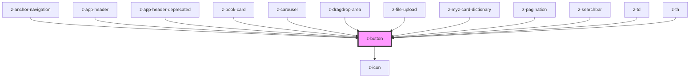

# z-button

<!-- Auto Generated Below -->

## Properties

| Property        | Attribute         | Description                                                                                                        | Type                                                                                                                      | Default                 |
| --------------- | ----------------- | ------------------------------------------------------------------------------------------------------------------ | ------------------------------------------------------------------------------------------------------------------------- | ----------------------- |
| `disabled`      | `disabled`        | HTML button disabled attribute.                                                                                    | `boolean`                                                                                                                 | `false`                 |
| `href`          | `href`            | HTML <a> href attribute. If it is set, it renders an HTML <a> tag.                                                 | `string`                                                                                                                  | `undefined`             |
| `htmlAriaLabel` | `html-aria-label` | `aria-label` for the internal button element. Mostly needed when no text is present, like for an icon-only button. | `string`                                                                                                                  | `undefined`             |
| `htmlRole`      | `html-role`       | `role` attribute for the internal button element. Used for accessibility.                                          | `string`                                                                                                                  | `undefined`             |
| `htmlid`        | `htmlid`          | Identifier, should be unique.                                                                                      | `string`                                                                                                                  | `undefined`             |
| `icon`          | `icon`            | `z-icon` name to use (optional).                                                                                   | `string`                                                                                                                  | `undefined`             |
| `iconPosition`  | `icon-position`   | the button icon position. Defaults to `left`                                                                       | `IconPosition.LEFT \| IconPosition.RIGHT`                                                                                 | `IconPosition.LEFT`     |
| `name`          | `name`            | HTML button name attribute.                                                                                        | `string`                                                                                                                  | `undefined`             |
| `size`          | `size`            | Available sizes: `big`, `small` and `x-small`. Defaults to `big`.                                                  | `ButtonSize.BIG \| ButtonSize.SMALL \| ButtonSize.X_SMALL \| ControlSize.BIG \| ControlSize.SMALL \| ControlSize.X_SMALL` | `ControlSize.BIG`       |
| `target`        | `target`          | HTML a target attribute.                                                                                           | `string`                                                                                                                  | `undefined`             |
| `type`          | `type`            | HTML button type attribute.                                                                                        | `ButtonType.BUTTON \| ButtonType.RESET \| ButtonType.SUBMIT`                                                              | `ButtonType.BUTTON`     |
| `variant`       | `variant`         | Graphical variant: `primary`, `secondary`, `tertiary`. Defaults to `primary`.                                      | `ButtonVariant.PRIMARY \| ButtonVariant.SECONDARY \| ButtonVariant.TERTIARY`                                              | `ButtonVariant.PRIMARY` |

## Slots

| Slot | Description  |
| ---- | ------------ |
|      | button label |

## Dependencies

### Used by

 - [z-anchor-navigation](../z-anchor-navigation)
 - [z-app-header](../z-app-header)
 - [z-app-header-deprecated](../deprecated/z-app-header-deprecated)
 - [z-book-card](../book-card/z-book-card)
 - [z-carousel](../z-carousel)
 - [z-dragdrop-area](../file-upload/z-dragdrop-area)
 - [z-file-upload](../file-upload/z-file-upload)
 - [z-myz-card-dictionary](../../snowflakes/myz/card/z-myz-card-dictionary)
 - [z-pagination](../z-pagination)
 - [z-searchbar](../z-searchbar)
 - [z-td](../table/cells/z-td)
 - [z-th](../table/cells/z-th)

### Depends on

- [z-icon](../z-icon)

### Graph

```mermaid
graph TD;
  z-button --> z-icon
  z-anchor-navigation --> z-button
  z-app-header --> z-button
  z-app-header-deprecated --> z-button
  z-book-card --> z-button
  z-carousel --> z-button
  z-dragdrop-area --> z-button
  z-file-upload --> z-button
  z-myz-card-dictionary --> z-button
  z-pagination --> z-button
  z-searchbar --> z-button
  z-td --> z-button
  z-th --> z-button
  style z-button fill:#f9f,stroke:#333,stroke-width:4px
```

----------------------------------------------

*Built with [StencilJS](https://stenciljs.com/)*
