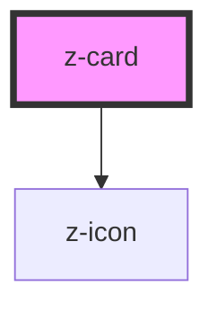

# z-card

[Abstract](https://app.abstract.com/projects/fd370780-e659-11e8-99dc-0d08537c5fde/branches/e696391e-bd14-4345-a98c-78343d192340/commits/5078c674ea888e961e09ac28741f206cb8506111/files/9f586aa0-bd5b-4c12-9541-aed2e98a7a9c/layers/61FBCDE5-1C49-442B-A262-EA3E73FA352F?collectionId=12a021f0-42e6-4e22-b64a-df001c3d6917&collectionLayerId=9986ef95-6efb-4e31-ae1f-c037d0f16b9d&mode=build&selected=root-45C828A6-52D2-4722-8891-AEEAA2C6E021)

## Implementation state

Variants:

- [x] Default
- [x] Border
- [x] Shadow
- [x] Overlay
- [x] Text

Orientation:

- [x] Vertical
- [ ] Horizontal

Interactions:

- [x] Click
- [ ] Multi select
- [ ] Hover actions
- [ ] Reveal

Cover variants:

- [x] Horizontal
- [ ] Vertical
- [x] With icon
- [ ] Square
- [ ] Circle

---

## CSS Variables

- `--z-card--color-cover-background`: used to set the background color of the color cover.
- `--z-card--border-color`: used to set the border color of the card.
- `--aspect-ratio`: used to set the ratio of the cover (respecting the indications of the design). Default is `1.62`.
- `--z-card--text-background`: used to set the background color of the text variant
- `--z-card--text-border-radius`: used to set the border radius for the text variant
- `--z-card--text-border`: used to set the border for the text variant

---

## Notes

The width of the card must be set externally, respecting the grid indication of the design.

---

<!-- Auto Generated Below -->

## Overview

ZCard component.
The width of the card must be set by its container, following the grid indications of the design.

## Properties

| Property     | Attribute     | Description                                                                                                                                                               | Type                                                                                  | Default     |
| ------------ | ------------- | ------------------------------------------------------------------------------------------------------------------------------------------------------------------------- | ------------------------------------------------------------------------------------- | ----------- |
| `clickable`  | `clickable`   | Enable "clickable" styles like hover background and cursor, focus shadow on the whole card, etc. Always set this to `true` when putting an `<a>` tag in the `title` slot. | `boolean`                                                                             | `false`     |
| `coverIcon`  | `cover-icon`  | Name of the icon to place over the image cover                                                                                                                            | `string`                                                                              | `undefined` |
| `showShadow` | `show-shadow` | Enable shadow. Default: false.                                                                                                                                            | `boolean`                                                                             | `false`     |
| `variant`    | `variant`     | Card variant. Can be one of "text", "border", "shadow", "overlay". Leave it undefined for the default card.                                                               | `CardVariant.BORDER \| CardVariant.OVERLAY \| CardVariant.SHADOW \| CardVariant.TEXT` | `undefined` |

## Slots

| Slot         | Description                                                                                                                                                                                                                |
| ------------ | -------------------------------------------------------------------------------------------------------------------------------------------------------------------------------------------------------------------------- |
| `"action"`   | Interactive elements to place at the bottom of the card. To put non-interactive elements here when using an `<a>` tag in the `title` slot, and use this as a sort of "footer", set `z-index: 0` on each of those elements. |
| `"cover"`    | Image cover                                                                                                                                                                                                                |
| `"metadata"` | Metadata                                                                                                                                                                                                                   |
| `"text"`     |                                                                                                                                                                                                                            |
| `"title"`    | Using an `<a>` tag here will make the whole card clickable as if the link was wrapping it.                                                                                                                                 |

## Dependencies

### Depends on

- [z-icon](../z-icon)

### Graph

----------------------------------------------

*Built with [StencilJS](https://stenciljs.com/)*
