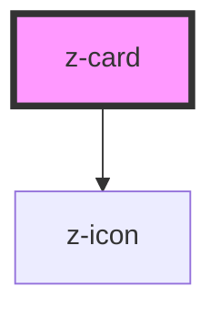

# z-card

<!-- Auto Generated Below -->

## Overview

ZCard component.
The width of the card must be set by its container, following the grid indications of the design.

## Properties

| Property     | Attribute     | Description                                                                                                                                                               | Type                                                                                  | Default     |
| ------------ | ------------- | ------------------------------------------------------------------------------------------------------------------------------------------------------------------------- | ------------------------------------------------------------------------------------- | ----------- |
| `clickable`  | `clickable`   | Enable "clickable" styles like hover background and cursor, focus shadow on the whole card, etc. Always set this to `true` when putting an `<a>` tag in the `title` slot. | `boolean`                                                                             | `false`     |
| `coverIcon`  | `cover-icon`  | Name of the icon to place over the image cover                                                                                                                            | `string`                                                                              | `undefined` |
| `showShadow` | `show-shadow` | Enable shadow. Default: false.                                                                                                                                            | `boolean`                                                                             | `false`     |
| `variant`    | `variant`     | Card variant. Can be one of "text", "border", "shadow", "overlay". Leave it undefined for the default card.                                                               | `CardVariant.BORDER \| CardVariant.OVERLAY \| CardVariant.SHADOW \| CardVariant.TEXT` | `undefined` |

## Slots

| Slot         | Description                                                                                                                                                                                                                |
| ------------ | -------------------------------------------------------------------------------------------------------------------------------------------------------------------------------------------------------------------------- |
| `"action"`   | Interactive elements to place at the bottom of the card. To put non-interactive elements here when using an `<a>` tag in the `title` slot, and use this as a sort of "footer", set `z-index: 0` on each of those elements. |
| `"cover"`    | Image cover                                                                                                                                                                                                                |
| `"metadata"` | Metadata                                                                                                                                                                                                                   |
| `"text"`     |                                                                                                                                                                                                                            |
| `"title"`    | Using an `<a>` tag here will make the whole card clickable as if the link was wrapping it.                                                                                                                                 |

## CSS Custom Properties

| Name                               | Description                                                                |
| ---------------------------------- | -------------------------------------------------------------------------- |
| `--aspect-ratio`                   | Cover aspect ratio. Default: `1.62`                                        |
| `--z-card--border-color`           | Default: `var(--gray200)`                                                  |
| `--z-card--color-cover-background` | Cover color. Default: `var(--color-surface01)`                             |
| `--z-card--text-background`        | Background color for the `text` variant. Default: `var(--color-surface01)` |
| `--z-card--text-border`            | Configure CSS `border`. Default: `none`                                    |
| `--z-card--text-border-radius`     | Default: `none`                                                            |
| `--z-card--text-padding`           | Configure CSS `padding`. Default: `none`                                   |

## Dependencies

### Depends on

- [z-icon](../z-icon)

### Graph

```mermaid
graph TD;
  z-card --> z-icon
  style z-card fill:#f9f,stroke:#333,stroke-width:4px
```

----------------------------------------------

*Built with [StencilJS](https://stenciljs.com/)*
