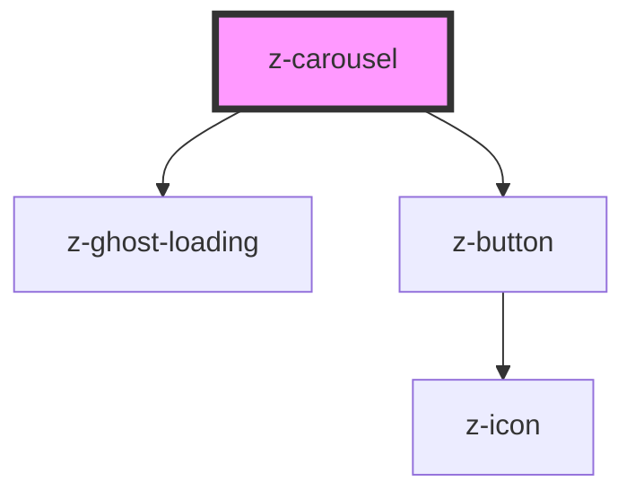

# z-carousel

Show element in a carousel.
Elements are passed to carousel using slots. 
To activate keyboard navigation through elements, use any <a href="https://html.spec.whatwg.org/multipage/interaction.html#the-tabindex-attribute">"tabbable" element</a> or add the attribute `tabindex="0"`.

Progress indicators are only shown in single mode.
To activate single mode, set the attribute `single` to `true` and set a width to the carousel.

<!-- Auto Generated Below -->

## Overview

ZCarousel component.

## Properties

| Property             | Attribute              | Description                                                                                                                                                                                                      | Type                                                           | Default     |
| -------------------- | ---------------------- | ---------------------------------------------------------------------------------------------------------------------------------------------------------------------------------------------------------------- | -------------------------------------------------------------- | ----------- |
| `arrowsPosition`     | `arrows-position`      | Arrow buttons position                                                                                                                                                                                           | `CarouselArrowsPosition.BOTTOM \| CarouselArrowsPosition.OVER` | `undefined` |
| `fixedArrows`        | `fixed-arrows`         | Whether the navigation arrow buttons over the items are always visible or only on mouse hover. If set to `false`, the arrows will not be visible on mobile. Only meaningful with `arrowsPosition` set to `OVER`. | `boolean`                                                      | `true`      |
| `ghostLoadingHeight` | `ghost-loading-height` | The height of the ghost loader (only visible when `isLoading` is set to `true`)                                                                                                                                  | `number`                                                       | `100`       |
| `infinite`           | `infinite`             | When enabled, navigating next the last item will go back to the first item and vice versa.                                                                                                                       | `boolean`                                                      | `false`     |
| `isLoading`          | `is-loading`           | The z-carousel is on loading state                                                                                                                                                                               | `boolean`                                                      | `undefined` |
| `label`              | `label`                | The z-carousel title                                                                                                                                                                                             | `string`                                                       | `undefined` |
| `progressMode`       | `progress-mode`        | Progress indicator type. Only available for `single` mode                                                                                                                                                        | `CarouselProgressMode.DOTS \| CarouselProgressMode.NUMBERS`    | `undefined` |
| `single`             | `single`               | Shows only one content at a time                                                                                                                                                                                 | `boolean`                                                      | `false`     |

## Events

| Event         | Description                                        | Type                                    |
| ------------- | -------------------------------------------------- | --------------------------------------- |
| `indexChange` | Emitted on index change and only in `single` mode. | `CustomEvent<{ currentItem: number; }>` |

## Slots

| Slot | Description                                           |
| ---- | ----------------------------------------------------- |
|      | Carousel items. Use `<li>` elements inside this slot. |

## Dependencies

### Depends on

- [z-ghost-loading](../z-ghost-loading)
- [z-button](../z-button)

### Graph

----------------------------------------------

*Built with [StencilJS](https://stenciljs.com/)*
