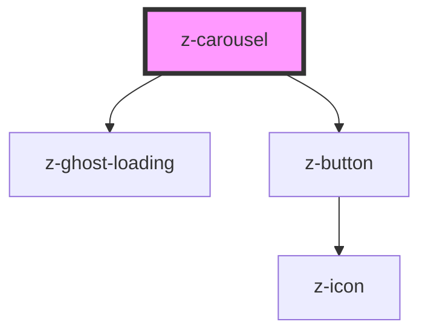

# z-carousel

Show element in a carousel.
Elements are passed to carousel using slots. 
To activate keyboard navigation through elements, use any <a href="https://html.spec.whatwg.org/multipage/interaction.html#the-tabindex-attribute">"tabbable" element</a> or add the attribute `tabindex="0"`.

<!-- Auto Generated Below -->

## Properties

| Property             | Attribute              | Description                                                                                                                          | Type                                                              | Default     |
| -------------------- | ---------------------- | ------------------------------------------------------------------------------------------------------------------------------------ | ----------------------------------------------------------------- | ----------- |
| `buttons`            | `buttons`              | arrow buttons style if given                                                                                                         | `CarouselButtonOptions.BOTTOM \| CarouselButtonOptions.TOP`       | `undefined` |
| `ghostLoadingHeight` | `ghost-loading-height` | the height of z-carousel ghost loading, this prop is mandatory when isloading is set to true, as otherwise the component won't show. | `number`                                                          | `100`       |
| `isLoading`          | `is-loading`           | whether the z-carousel is on loading state                                                                                           | `boolean`                                                         | `undefined` |
| `progress`           | `progress`             | progress indicators if given                                                                                                         | `CarouselProgressOptions.DOTS \| CarouselProgressOptions.NUMBERS` | `undefined` |

## Slots

| Slot | Description                                                                            |
| ---- | -------------------------------------------------------------------------------------- |
|      | carousel items. use `<li>` elements inside this slot as it is wrapped inside an `<ul>` |

## Dependencies

### Depends on

- [z-ghost-loading](../z-ghost-loading)
- [z-button](../buttons/z-button)

### Graph

----------------------------------------------

*Built with [StencilJS](https://stenciljs.com/)*
