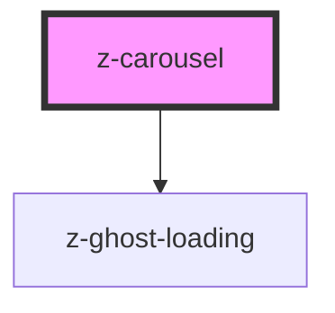

# z-carousel

<!-- Auto Generated Below -->

## Properties

| Property             | Attribute            | Description                                 | Type      | Default     |
| -------------------- | -------------------- | ------------------------------------------- | --------- | ----------- |
| `ghostloadingheight` | `ghostloadingheight` | sets the height of z-carousel ghost loading | `string`  | `undefined` |
| `isloading`          | `isloading`          | used for handle z-carousel ghost loading    | `boolean` | `undefined` |

## Slots

| Slot | Description                                                                            |
| ---- | -------------------------------------------------------------------------------------- |
|      | carousel items. use `<li>` elements inside this slot as it is wrapped inside an `<ul>` |

## Dependencies

### Depends on

- [z-ghost-loading](../z-ghost-loading)

### Graph

----------------------------------------------

*Built with [StencilJS](https://stenciljs.com/)*
