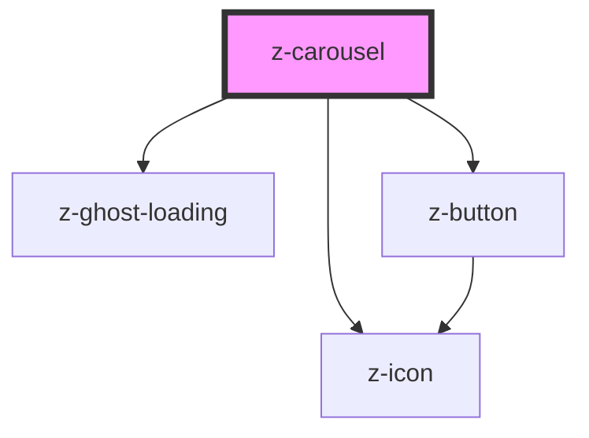

# z-carousel

Show element in a carousel.
Elements are passed to carousel using slots. 
To activate keyboard navigation through elements, use any <a href="https://html.spec.whatwg.org/multipage/interaction.html#the-tabindex-attribute">"tabbable" element</a> or add the attribute `tabindex="0"`.

Progress indicators are only shown in single mode.
To activate single mode, set the attribute `single` to `true` and set a width to the carousel.

<!-- Auto Generated Below -->

## Properties

| Property             | Attribute              | Description                                                                                                                          | Type                                                           | Default     |
| -------------------- | ---------------------- | ------------------------------------------------------------------------------------------------------------------------------------ | -------------------------------------------------------------- | ----------- |
| `arrows`             | `arrows`               | arrow buttons style if given                                                                                                         | `CarouselButtonPosition.BOTTOM \| CarouselButtonPosition.OVER` | `undefined` |
| `ghostLoadingHeight` | `ghost-loading-height` | the height of z-carousel ghost loading, this prop is mandatory when isloading is set to true, as otherwise the component won't show. | `number`                                                       | `100`       |
| `isLoading`          | `is-loading`           | the z-carousel is on loading state                                                                                                   | `boolean`                                                      | `undefined` |
| `progress`           | `progress`             | progress indicators. progress is available only for "single" mode                                                                    | `CarouselProgressMode.DOTS \| CarouselProgressMode.NUMBERS`    | `undefined` |
| `single`             | `single`               | shows only one content at a time                                                                                                     | `boolean`                                                      | `false`     |

## Events

| Event         | Description                              | Type               |
| ------------- | ---------------------------------------- | ------------------ |
| `indexChange` | emitted on single page mode index change | `CustomEvent<any>` |

## Slots

| Slot | Description                                                                            |
| ---- | -------------------------------------------------------------------------------------- |
|      | carousel items. use `<li>` elements inside this slot as it is wrapped inside an `<ul>` |

## Dependencies

### Depends on

- [z-ghost-loading](../z-ghost-loading)
- [z-button](../buttons/z-button)
- [z-icon](../icons/z-icon)

### Graph

----------------------------------------------

*Built with [StencilJS](https://stenciljs.com/)*
