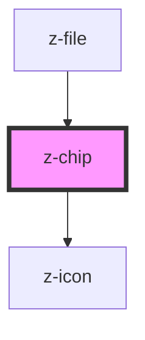

# z-chip

<!-- Auto Generated Below -->

## Properties

| Property          | Attribute          | Description                                         | Type                                                               | Default                |
| ----------------- | ------------------ | --------------------------------------------------- | ------------------------------------------------------------------ | ---------------------- |
| `disabled`        | `disabled`         | set z-chip as disabled                              | `boolean`                                                          | `false`                |
| `htmlAriaLabel`   | `html-aria-label`  | `aria-label` for the icon button                    | `string`                                                           | `undefined`            |
| `icon`            | `icon`             | Non interactive icon                                | `string`                                                           | `undefined`            |
| `interactiveIcon` | `interactive-icon` | z-chip interactive icon                             | `string`                                                           | `undefined`            |
| `type`            | `type`             | z-chip size type, can be default, medium or small   | `ZChipType.DEFAULT \| ZChipType.MEDIUM \| ZChipType.SMALL`         | `ZChipType.DEFAULT`    |
| `variant`         | `variant`          | z-chip variant type, can be outline, filled or soft | `ZChipVariant.FILLED \| ZChipVariant.OUTLINE \| ZChipVariant.SOFT` | `ZChipVariant.OUTLINE` |

## Events

| Event                  | Description               | Type               |
| ---------------------- | ------------------------- | ------------------ |
| `interactiveIconClick` | click on interactive icon | `CustomEvent<any>` |

## Dependencies

### Used by

 - [z-file](../file-upload/z-file)

### Depends on

- [z-icon](../z-icon)

### Graph

----------------------------------------------

*Built with [StencilJS](https://stenciljs.com/)*
