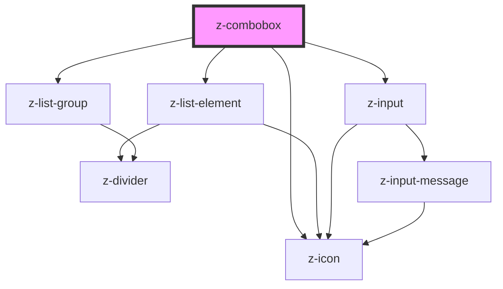

# z-combobox

<!-- readme-group="combobox" -->

```html
<z-combobox
  inputid="combo_1"
  items='[{"id":"item_1","name":"primo elemento","checked":false},{"id":"item_2","name":"secondo elemento","checked":true}]'
  hassearch="true"
  searchlabel="Autore"
  searchplaceholder="Cerca Autore"
  label="Combo Corta"
  closesearchtext="CHIUDI"
  isopen="true"
></z-combobox>
<z-combobox
  inputid="combo_2"
  items='[{"id":"item_1","name":"primo elemento","checked":false},{"id":"item_2","name":"secondo elemento","checked":true},{"id":"item_3","name":"terzo","checked":false},{"id":"item_4","name":"quarto elemento","checked":true},{"id":"item_5","name":"quinto elemento","checked":false},{"id":"item_6","name":"sesto elemento","checked":true}]'
  hassearch="true"
  searchlabel="Autore"
  searchplaceholder="Cerca Autore"
  label="Combo Corta"
  label="Combo Lunga"
  closesearchtext="CHIUDI"
></z-combobox>
```

<!-- Auto Generated Below -->


## Properties

| Property            | Attribute           | Description                                                       | Type                                                          | Default                 |
| ------------------- | ------------------- | ----------------------------------------------------------------- | ------------------------------------------------------------- | ----------------------- |
| `checkalltext`      | `checkalltext`      | check all label (optional)                                        | `string`                                                      | `"Seleziona tutti"`     |
| `disabled`          | `disabled`          | the combobox is disabled                                          | `boolean`                                                     | `false`                 |
| `hascheckall`       | `hascheckall`       | show "check all" checkbox (optional)                              | `boolean`                                                     | `false`                 |
| `hasgroupitems`     | `hasgroupitems`     | group items by category                                           | `boolean`                                                     | `undefined`             |
| `hassearch`         | `hassearch`         | show search input flag (optional)                                 | `boolean`                                                     | `false`                 |
| `inputid`           | `inputid`           | input unique id                                                   | `string`                                                      | ``combo-${randomId()}`` |
| `isfixed`           | `isfixed`           | fixed style flag                                                  | `boolean`                                                     | `false`                 |
| `isopen`            | `isopen`            | toggle combo list opening flag                                    | `boolean`                                                     | `false`                 |
| `items`             | `items`             | list items array                                                  | `ComboItem[] \| string`                                       | `undefined`             |
| `label`             | `label`             | label text                                                        | `string`                                                      | `undefined`             |
| `maxcheckableitems` | `maxcheckableitems` | max number of checkable items (0 = unlimited)                     | `number`                                                      | `0`                     |
| `noresultslabel`    | `noresultslabel`    | no result text message                                            | `string`                                                      | `"Nessun risultato"`    |
| `searchlabel`       | `searchlabel`       | search input label text (optional)                                | `string`                                                      | `undefined`             |
| `searchplaceholder` | `searchplaceholder` | search input placeholder text (optional)                          | `string`                                                      | `undefined`             |
| `searchtitle`       | `searchtitle`       | search input title text (optional)                                | `string`                                                      | `undefined`             |
| `size`              | `size`              | Available sizes: `big`, `small` and `x-small`. Defaults to `big`. | `ControlSize.BIG \| ControlSize.SMALL \| ControlSize.X_SMALL` | `ControlSize.BIG`       |
| `uncheckalltext`    | `uncheckalltext`    | uncheck all label (optional)                                      | `string`                                                      | `"Deseleziona tutti"`   |


## Events

| Event            | Description                                                 | Type               |
| ---------------- | ----------------------------------------------------------- | ------------------ |
| `comboboxChange` | Emitted when value is checked/unchecked. Returns id, items. | `CustomEvent<any>` |


## Dependencies

### Depends on

- [z-icon](../z-icon)
- [z-list-element](../list/z-list-element)
- [z-input](../z-input)
- [z-list-group](../list/z-list-group)

### Graph


----------------------------------------------

*Built with [StencilJS](https://stenciljs.com/)*
