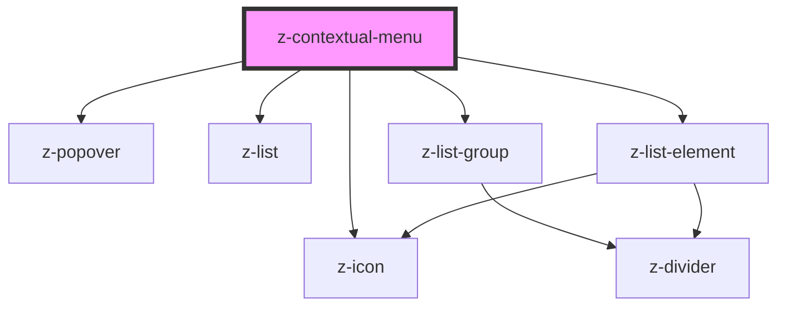

# contextual-menu

<!-- Auto Generated Below -->

## Properties

| Property          | Attribute          | Description                                             | Type                                                                                                                                                                                                                                                                                                                                                                                                                                                                                                    | Default                         |
| ----------------- | ------------------ | ------------------------------------------------------- | ------------------------------------------------------------------------------------------------------------------------------------------------------------------------------------------------------------------------------------------------------------------------------------------------------------------------------------------------------------------------------------------------------------------------------------------------------------------------------------------------------- | ------------------------------- |
| `color`           | `color`            | [optional] Sets text color of ZContextualMenu's content | `string`                                                                                                                                                                                                                                                                                                                                                                                                                                                                                                | `"color-primary01"`             |
| `elements`        | `elements`         | elements of ZContextualMenu                             | `string`                                                                                                                                                                                                                                                                                                                                                                                                                                                                                                | `undefined`                     |
| `popoverPosition` | `popover-position` | [optional] Sets the position of the popover             | `typeof PopoverPosition["above-center"] \| typeof PopoverPosition["above-left"] \| typeof PopoverPosition["above-right"] \| typeof PopoverPosition["after-center"] \| typeof PopoverPosition["after-down"] \| typeof PopoverPosition["after-up"] \| typeof PopoverPosition["before-center"] \| typeof PopoverPosition["before-down"] \| typeof PopoverPosition["before-up"] \| typeof PopoverPosition["below-center"] \| typeof PopoverPosition["below-left"] \| typeof PopoverPosition["below-right"]` | `PopoverPosition["after-down"]` |

## Events

| Event                 | Description                                 | Type               |
| --------------------- | ------------------------------------------- | ------------------ |
| `clickContextualMenu` | remove filter click event, returns filterid | `CustomEvent<any>` |

## Dependencies

### Depends on

- [z-popover](../z-popover)
- [z-icon](../icons/z-icon)
- [z-list](../list/z-list)
- [z-list-group](../list/z-list-group)
- [z-list-element](../list/z-list-element)

### Graph

----------------------------------------------

*Built with [StencilJS](https://stenciljs.com/)*
