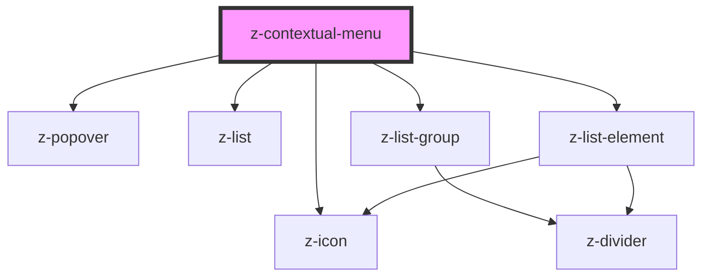

# contextual-menu

<!-- Auto Generated Below -->

## Properties

| Property          | Attribute          | Description                                             | Type                                                                                                                                                                                                                                                                                                                                                                                  | Default                         |
| ----------------- | ------------------ | ------------------------------------------------------- | ------------------------------------------------------------------------------------------------------------------------------------------------------------------------------------------------------------------------------------------------------------------------------------------------------------------------------------------------------------------------------------- | ------------------------------- |
| `color`           | `color`            | [optional] Sets text color of ZContextualMenu's content | `string`                                                                                                                                                                                                                                                                                                                                                                              | `"color-primary01"`             |
| `elements`        | `elements`         | Elements of ZContextualMenu                             | `string`                                                                                                                                                                                                                                                                                                                                                                              | `undefined`                     |
| `popoverPosition` | `popover-position` | [optional] Sets the position of the popover             | `PopoverPositions.auto \| PopoverPositions.bottom \| PopoverPositions.bottom_left \| PopoverPositions.bottom_right \| PopoverPositions.left \| PopoverPositions.left_bottom \| PopoverPositions.left_top \| PopoverPositions.right \| PopoverPositions.right_bottom \| PopoverPositions.right_top \| PopoverPositions.top \| PopoverPositions.top_left \| PopoverPositions.top_right` | `PopoverPositions.bottom_right` |

## Events

| Event                 | Description                                 | Type               |
| --------------------- | ------------------------------------------- | ------------------ |
| `clickContextualMenu` | remove filter click event, returns filterid | `CustomEvent<any>` |

## Dependencies

### Depends on

- [z-icon](../icons/z-icon)
- [z-popover](../z-popover)
- [z-list](../list/z-list)
- [z-list-group](../list/z-list-group)
- [z-list-element](../list/z-list-element)

### Graph

---

_Built with [StencilJS](https://stenciljs.com/)_
