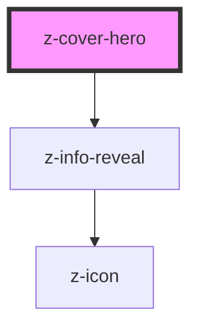

# z-cover-hero

<!-- Auto Generated Below -->

## Properties

| Property   | Attribute  | Description                                                                                                    | Type                                                              | Default                        |
| ---------- | ---------- | -------------------------------------------------------------------------------------------------------------- | ----------------------------------------------------------------- | ------------------------------ |
| `caption`  | `caption`  | Cover hero caption text to display in the z-info-reveal component.                                             | `string`                                                          | `''`                           |
| `position` | `position` | Cover hero content position (only for stacked variant).                                                        | `CoverHeroContentPosition.bottom \| CoverHeroContentPosition.top` | `CoverHeroContentPosition.top` |
| `variant`  | `variant`  | Cover hero variant. Can be one of "overlay", "stacked". Leave it undefined for the default cover hero variant. | `CoverHeroVariants.overlay \| CoverHeroVariants.stacked`          | `CoverHeroVariants.overlay`    |

## Dependencies

### Depends on

- [z-info-reveal](../z-info-reveal)

### Graph

----------------------------------------------

*Built with [StencilJS](https://stenciljs.com/)*
