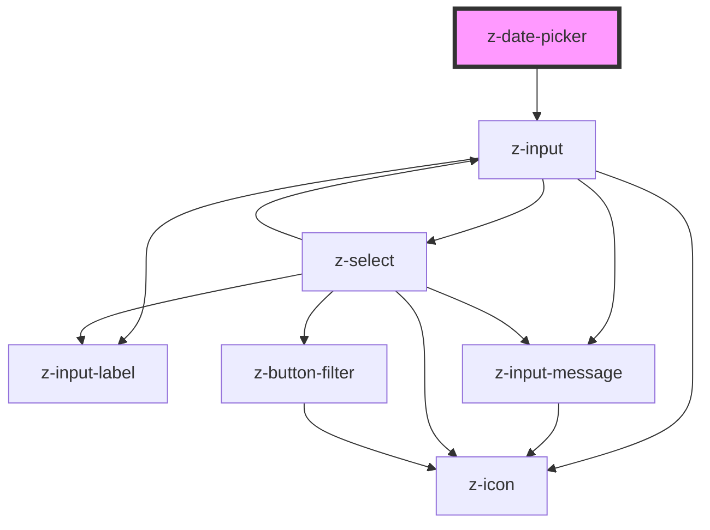

# z-date-picker

<!-- Auto Generated Below -->

## Properties

| Property   | Attribute   | Description | Type      | Default     |
| ---------- | ----------- | ----------- | --------- | ----------- |
| `id`       | `id`        |             | `string`  | `undefined` |
| `showTime` | `show-time` |             | `boolean` | `undefined` |

## Events

| Event        | Description | Type               |
| ------------ | ----------- | ------------------ |
| `dateSelect` |             | `CustomEvent<any>` |

## Dependencies

### Depends on

- [z-input](../inputs/z-input)

### Graph

----------------------------------------------

*Built with [StencilJS](https://stenciljs.com/)*
