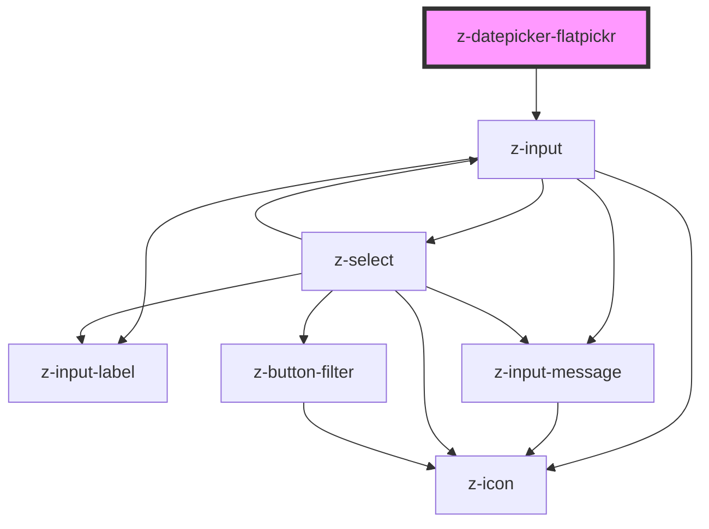

# z-datepicker-flatpickr

<!-- Auto Generated Below -->

## Properties

| Property | Attribute | Description | Type     | Default     |
| -------- | --------- | ----------- | -------- | ----------- |
| `myProp` | `my-prop` |             | `string` | `undefined` |

## Dependencies

### Depends on

- [z-input](../inputs/z-input)

### Graph

----------------------------------------------

*Built with [StencilJS](https://stenciljs.com/)*
