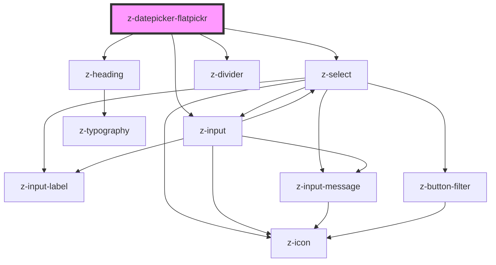

# z-datepicker-flatpickr

<!-- Auto Generated Below -->

## Events

| Event        | Description | Type               |
| ------------ | ----------- | ------------------ |
| `dateSelect` |             | `CustomEvent<any>` |

## Dependencies

### Depends on

- [z-select](../inputs/z-select)
- [z-heading](../typography/z-heading)
- [z-input](../inputs/z-input)
- [z-divider](../z-divider)

### Graph

----------------------------------------------

*Built with [StencilJS](https://stenciljs.com/)*
