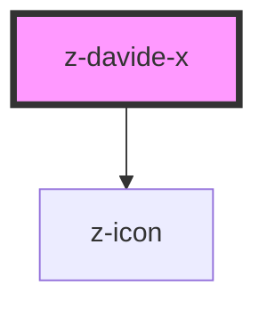

# z-davide-x

<!-- Auto Generated Below -->

## Properties

| Property    | Attribute   | Description | Type      | Default     |
| ----------- | ----------- | ----------- | --------- | ----------- |
| `href`      | `href`      |             | `string`  | `undefined` |
| `icon`      | `icon`      |             | `string`  | `undefined` |
| `notstyled` | `notstyled` |             | `boolean` | `undefined` |

## Events

| Event     | Description | Type               |
| --------- | ----------- | ------------------ |
| `onClick` |             | `CustomEvent<any>` |

## Dependencies

### Depends on

- [z-icon](../icons/z-icon)

### Graph

----------------------------------------------

*Built with [StencilJS](https://stenciljs.com/)*
