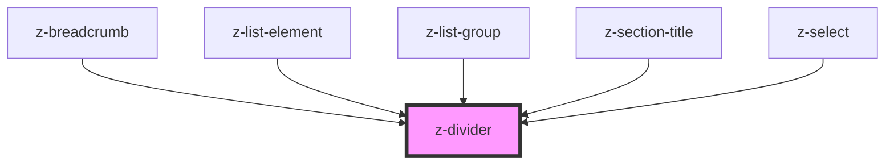

# z-divider

<!-- Auto Generated Below -->

## Properties

| Property      | Attribute     | Description                   | Type                                                           | Default                         |
| ------------- | ------------- | ----------------------------- | -------------------------------------------------------------- | ------------------------------- |
| `color`       | `color`       | [optional] Divider color      | `string`                                                       | `"gray200"`                     |
| `orientation` | `orientation` | [optional] Divider orintation | `DividerOrientation.HORIZONTAL \| DividerOrientation.VERTICAL` | `DividerOrientation.HORIZONTAL` |
| `size`        | `size`        | [optional] Divider size       | `DividerSize.LARGE \| DividerSize.MEDIUM \| DividerSize.SMALL` | `DividerSize.SMALL`             |

## Dependencies

### Used by

 - [z-breadcrumb](../z-breadcrumb)
 - [z-list-element](../list/z-list-element)
 - [z-list-group](../list/z-list-group)
 - [z-section-title](../z-section-title)
 - [z-select](../z-select)

### Graph

----------------------------------------------

*Built with [StencilJS](https://stenciljs.com/)*
