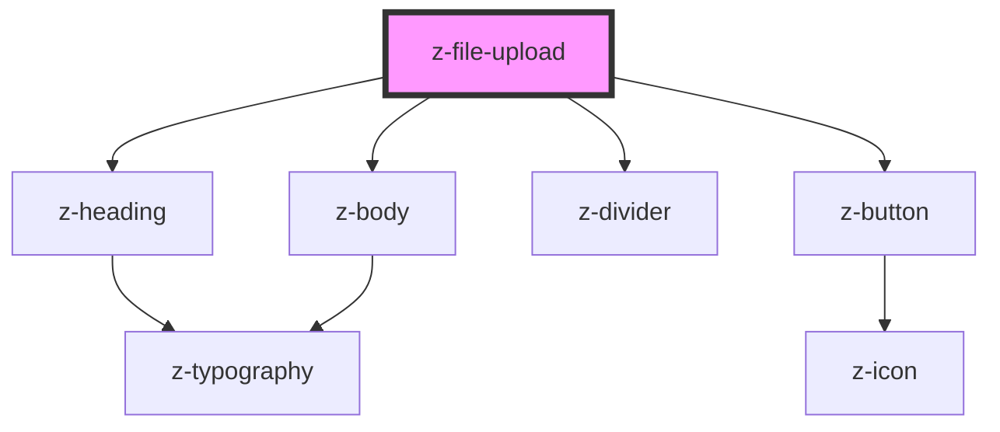

# z-file-upload

<!-- Auto Generated Below -->

## Properties

| Property         | Attribute         | Description                                                   | Type                                                                                                                            | Default     |
| ---------------- | ----------------- | ------------------------------------------------------------- | ------------------------------------------------------------------------------------------------------------------------------- | ----------- |
| `acceptedFormat` | `accepted-format` | Prop indicating the accepted file type: ex ".pdf, .doc, .jpg" | `string`                                                                                                                        | `undefined` |
| `variant`        | `variant`         | Prop indicating the button variant                            | `ButtonVariantEnum.primary \| ButtonVariantEnum.secondary \| ButtonVariantEnum.tertiary \| typeof ButtonVariantEnum["dark-bg"]` | `undefined` |

## Events

| Event       | Description                                | Type               |
| ----------- | ------------------------------------------ | ------------------ |
| `fileInput` | Emitted when user select one or more files | `CustomEvent<any>` |

## Dependencies

### Depends on

- [z-heading](../typography/z-heading)
- [z-body](../typography/z-body)
- [z-divider](../z-divider)
- [z-button](../buttons/z-button)

### Graph

----------------------------------------------

*Built with [StencilJS](https://stenciljs.com/)*
