# z-icon

<!-- readme-group="icon" -->

```html
<z-icon name="book-plus"></z-icon>
<z-icon
  name="chevron-down"
  iconid="zicon"
></z-icon>
<z-icon
  name="download"
  iconid="zicon"
  width="10"
  height="10"
></z-icon>
```

<!-- Auto Generated Below -->


## Properties

| Property | Attribute | Description            | Type     | Default     |
| -------- | --------- | ---------------------- | -------- | ----------- |
| `fill`   | `fill`    | icon fill (optional)   | `string` | `undefined` |
| `height` | `height`  | icon height (optional) | `number` | `undefined` |
| `iconid` | `iconid`  | icon id (optional)     | `string` | `undefined` |
| `name`   | `name`    | icon name              | `string` | `undefined` |
| `width`  | `width`   | icon width (optional)  | `number` | `undefined` |


## Dependencies

### Used by

 - [z-accordion](../z-accordion)
 - [z-app-header](../z-app-header)
 - [z-app-header-deprecated](../deprecated/z-app-header-deprecated)
 - [z-book-card](../z-book-card)
 - [z-book-card-deprecated](../z-book-card-deprecated)
 - [z-breadcrumb](../z-breadcrumb)
 - [z-button](../z-button)
 - [z-button-sort](../z-button-sort)
 - [z-card](../z-card)
 - [z-chip](../z-chip)
 - [z-combobox](../z-combobox)
 - [z-info-box](../z-info-box)
 - [z-info-reveal](../z-info-reveal)
 - [z-input](../z-input)
 - [z-input-message](../z-input-message)
 - [z-list-element](../list/z-list-element)
 - [z-menu](../z-menu)
 - [z-menu-deprecated](../deprecated/z-menu-deprecated)
 - [z-menu-section](../z-menu-section)
 - [z-menu-section-deprecated](../deprecated/z-menu-section-deprecated)
 - [z-modal](../z-modal)
 - [z-myz-card-alert](../../snowflakes/myz/card/z-myz-card-alert)
 - [z-myz-card-icon](../../snowflakes/myz/card/z-myz-card-icon)
 - [z-myz-card-info](../../snowflakes/myz/card/z-myz-card-info)
 - [z-myz-list-item](../../snowflakes/myz/list/z-myz-list-item)
 - [z-navigation-tabs](../z-navigation-tabs)
 - [z-notification](../z-notification)
 - [z-pagination](../z-pagination)
 - [z-panel-elem](../z-panel-elem)
 - [z-searchbar](../z-searchbar)
 - [z-select](../z-select)
 - [z-slideshow](../../snowflakes/myz/z-slideshow)
 - [z-stepper-item](../z-stepper-item)
 - [z-tag](../z-tag)
 - [z-th](../table/cells/z-th)
 - [z-toast-notification](../z-toast-notification)
 - [z-toggle-button](../z-toggle-button)
 - [z-toggle-switch](../z-toggle-switch)
 - [z-tr](../table/z-tr)

### Graph

```mermaid
graph TD;
  z-accordion --> z-icon
  z-app-header --> z-icon
  z-app-header-deprecated --> z-icon
  z-book-card --> z-icon
  z-book-card-deprecated --> z-icon
  z-breadcrumb --> z-icon
  z-button --> z-icon
  z-button-sort --> z-icon
  z-card --> z-icon
  z-chip --> z-icon
  z-combobox --> z-icon
  z-info-box --> z-icon
  z-info-reveal --> z-icon
  z-input --> z-icon
  z-input-message --> z-icon
  z-list-element --> z-icon
  z-menu --> z-icon
  z-menu-deprecated --> z-icon
  z-menu-section --> z-icon
  z-menu-section-deprecated --> z-icon
  z-modal --> z-icon
  z-myz-card-alert --> z-icon
  z-myz-card-icon --> z-icon
  z-myz-card-info --> z-icon
  z-myz-list-item --> z-icon
  z-navigation-tabs --> z-icon
  z-notification --> z-icon
  z-pagination --> z-icon
  z-panel-elem --> z-icon
  z-searchbar --> z-icon
  z-select --> z-icon
  z-slideshow --> z-icon
  z-stepper-item --> z-icon
  z-tag --> z-icon
  z-th --> z-icon
  z-toast-notification --> z-icon
  z-toggle-button --> z-icon
  z-toggle-switch --> z-icon
  z-tr --> z-icon
  style z-icon fill:#f9f,stroke:#333,stroke-width:4px
```


----------------------------------------------

*Built with [StencilJS](https://stenciljs.com/)*
