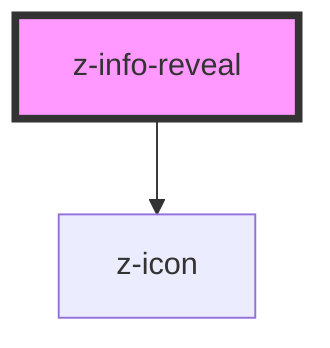

# z-info-reveal

Interactive info panel used to show short sentences, one at a time. The initial (closed) state always displays a custom icon and may contain a text label.

All the inner content is provided from the product.

<!-- Auto Generated Below -->

## Properties

| Property   | Attribute  | Description                                                | Type                                                                                                                               | Default                           |
| ---------- | ---------- | ---------------------------------------------------------- | ---------------------------------------------------------------------------------------------------------------------------------- | --------------------------------- |
| `icon`     | `icon`     | Name of the icon for the open button                       | `string`                                                                                                                           | `'informationsource'`             |
| `label`    | `label`    | Text that appears on closed panel next to the open button. | `string`                                                                                                                           | `undefined`                       |
| `position` | `position` | Position of the open/close button on the panel.            | `InfoRevealPosition.bottom_left \| InfoRevealPosition.bottom_right \| InfoRevealPosition.top_left \| InfoRevealPosition.top_right` | `InfoRevealPosition.bottom_right` |

## Dependencies

### Depends on

- [z-icon](../icons/z-icon)

### Graph

----------------------------------------------

*Built with [StencilJS](https://stenciljs.com/)*
